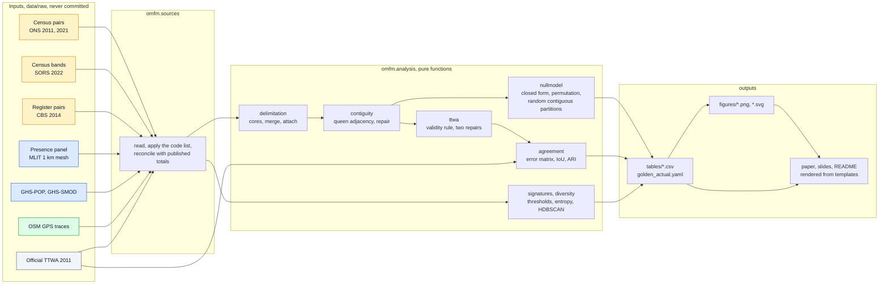

# urban-functional-maps

[](https://github.com/m-erts/urban-functional-maps/actions/workflows/ci.yml)
[](LICENSE)
[](LICENSE-CONTENT)

Open mobility data for functional-area maps: what each source leaves out, and how much of a result is scale, contiguity and algorithm.

Pipeline, paper and slides for the talk *Eurostat vs OSM vs Census: Choosing Open Mobility Data for Urban Function Maps*, prepared for FOSS4G 2026, Hiroshima. The talk was accepted and the session was cancelled; the material is published here in full.

| | |
|---|---|
| Paper (preprint) | [docs/paper/paper.md](docs/paper/paper.md) · [PDF](docs/paper/paper.pdf) |
| Slides | [docs/slides/index.html](docs/slides/index.html) · [PDF](docs/slides/slides.pdf) |
| Every number, with its status against the first version of the slides | [docs/RESULTS.md](docs/RESULTS.md) |
| Corrections to the first version of the slides | [docs/ERRATA.md](docs/ERRATA.md) |
| Inputs, licences, checksums | [docs/DATA_SOURCES.md](docs/DATA_SOURCES.md) · [data/manifest.yaml](data/manifest.yaml) |

## Research question

When functional areas are delimited from open data on the movement of people, how much of the result comes from the coding of the source, how much from the zoning (the modifiable areal unit problem), and how much from the algorithm? Which tests, run on the open file alone, separate the three?

## Findings

1. **Coding.** The 2021 census of England and Wales codes 12.6 million people without a commute with workplace = residence. Kept in the matrix, they raise within-unit commuting from 0.093 to 0.506.
2. **Scale and contiguity.** Self-containment under random relabelling has a closed form, `d + (1 - d) h`. Of the 0.696 scored by 235 areas on 7,264 units, 0.130 is scale, 0.435 is contiguity and 0.131 is the position of the boundaries.
3. **Algorithm.** 197 delimited areas against 173 official ones: adjusted Rand index 0.54. Enforcing the published validity rule of the official areas lowers it to 0.46. 12 settings that all give about 235 areas agree with each other at a median of 0.67.
4. **Classes.** Temporal profiles of 4,011 cells in Hiroshima form one cloud. The share of "mixed" cells runs from 17 % to 65 % with the threshold; HDBSCAN returns only noise at 9 of 12 settings.

| Partition (England and Wales) | Areas | Self-containment | from scale | from contiguity | from placement |
|---|---|---|---|---|---|
| 2011, own rules | 197 | 0.740 | 0.157 | 0.408 | 0.175 |
| 2011, official TTWA | 173 | 0.749 | 0.128 | 0.415 | 0.205 |
| 2021, own rules | 235 | 0.696 | 0.130 | 0.435 | 0.131 |
| 2021, official TTWA | 173 | 0.749 | 0.119 | 0.443 | 0.186 |


## Sources compared on six axes

Colour in every figure and slide: **Eurostat-type grid and presence statistics, blue** · **OpenStreetMap, green** · **census and register counts, amber**.

| Source | Spatial resolution | Temporal lag | Semantic depth | Licence | MAUP sensitivity | Computational cost |
|---|---|---|---|---|---|---|
| **Census pairs**, England and Wales (ONS WU01EW 2011, ODWP01EW 2021) | 7,264 MSOA polygons, 5,000 to 15,000 residents each; also districts and output areas | 2011: census March 2011, file August 2014. 2021: census March 2021, file October 2023 | Work only. 2021 adds a place-of-work indicator of 4 categories. No time of day | OGL v3 | Measured. Scale alone gives 19 % of the score at MSOA level and 69 % at district level | 1.8 M pairs. Delimitation 3 s; one permutation 20 ms; one random contiguous partition 0.2 s; validity repair by dissolution 80 s |
| **Census bands**, Serbia (SORS 2022) | 168 municipal polygons; destination in 4 nested bands | Census October 2022, table July 2024 | Work; education with pupils and students as one number | SORS terms, source cited | Not testable: one published level. 8 units are 0 by definition | Seconds. Urbanisation from a 100 m raster: 3 s |
| **Register pairs**, Netherlands (CBS 81252NED) | 40 COROP regions | December 2014, table October 2016; successors exist | Jobs of employees; sex and age | CC BY 4.0 | Not testable: pairs are published at the resolution of the 1970 basins only | 1,600 pairs; 27 s to fetch through OData |
| **Presence panel**, Japan (MLIT, provider Agoop) | 1 km mesh (JIS X 0410), 6,763 cells in one prefecture; 30 municipalities | About one month while it ran; no data after December 2021 | No purpose. Month x weekday or holiday x day or night. Residence in 4 nested rings | Government of Japan Standard Terms of Use 2.0 | Regular grid: no zoning choice at 1 km. Class shares depend on the threshold: mixed 17 to 65 % | 1.07 M rows; HDBSCAN grid of 24 runs on 4,011 cells: 4 s |
| **OSM public GPS traces** | Points; aggregated to H3 resolution 8 (0.74 km²) | None at upload; median trace year 2014 to 2022 in the three windows | Timestamp and position; no purpose, no person | ODbL | Not measured. 50 % of points in one cell in Hiroshima, so any statistic depends on where the cell boundary falls | 40 requests per window at one per second |
| **Grid reference**, GHS-POP 100 m and GHS-SMOD 1 km (JRC; degree of urbanisation of Eurostat and partners) | 100 m and 1 km, Mollweide | Release R2023A; epoch 2030 is a projection | Population; 8 settlement classes | CC BY 4.0 | Measured. Work self-containment against urban share: r = -0.28 weighted by area, -0.02 weighted by population | 75 MB tile; zonal statistics 3 s |

Eurostat statistics from mobile network operators do not exist as a cross-country dataset; the Multi-MNO project published a method and [open reference code](https://github.com/eurostat/multimno). Spain publishes hourly operator matrices; they are not processed here.

What each source publishes of the three dimensions:

| Source | Origin-destination pairs | Purpose | Time of day or week |
|---|---|---|---|
| Census pairs, England and Wales | full matrix | work | none |
| Census bands, Serbia | none, 4 bands | work; education | none |
| Register pairs, Netherlands | 40 x 40 | work | none |
| Presence panel, Japan | none, 4 rings | none | month, day type, day or night |
| OSM traces | trajectories of contributors | none | timestamps |

## Method



The measures, in one place (derivations in the [paper](docs/paper/paper.md), Section 3):

| Measure | Definition | Module |
|---|---|---|
| Diagonal share | `d = sum_i T_ii / T` | `analysis.selfcontainment` |
| Self-containment of a partition | flows that end in the area where they start / flows leaving labelled units | `analysis.selfcontainment` |
| Scale null, closed form | `E[SC0] = (D + h B) / T_L`, `h = sum_a n_a (n_a - 1) / (n (n - 1))` | `analysis.nullmodel.expected_sc` |
| Zoning null | mean self-containment of random contiguous partitions of the same sizes | `analysis.nullmodel.contiguous_null` |
| Spatial error matrix | `C[a, b] = sum of employed residents in candidate area a and reference area b` | `analysis.agreement.contingency` |
| Intersection over union | `C[a,b] / (C[a,.] + C[.,b] - C[a,b])`, best match per reference area | `analysis.agreement.match_report` |
| Omission, commission | `1 - C[a*,b] / C[.,b]`, `1 - C[a*,b] / C[a*,.]` | `analysis.agreement.match_report` |
| Adjusted Rand index, V-measure | from `C` | `analysis.agreement` |
| Entropy of a class or category distribution | `H = - sum p ln p`; Hill numbers of order 1 and 2 | `analysis.diversity` |
| Sample of a trace archive | distinct minutes; share of points in the busiest cell | `analysis.osm` |

## Reproduce

```bash
git clone https://github.com/m-erts/urban-functional-maps.git
cd urban-functional-maps
conda env create -f environment.yml && conda activate omfm     # or: pip install -r requirements.lock && pip install -e .
python scripts/fetch_data.py        # downloads what has a public address, lists what needs a manual step
make all                            # analysis, figures, register, documents, tests
```

| Step | Command | Time on a laptop (Apple M-series, 2026) |
|---|---|---|
| England and Wales: matrices, delimitation, nulls, repairs, agreement | `python scripts/run.py analysis --only uk` | 7 min |
| Iso-count experiment | `python scripts/run.py analysis --only uk_sweep` | 1 min |
| Serbia, Netherlands, Japan, OSM | `python scripts/run.py analysis --only rs,nl,jp,osm` | 10 s |
| Figures | `python scripts/run.py figures` | 2 min |
| Register and documents | `python scripts/run.py register && python scripts/render_docs.py` | 1 s |
| Tests | `pytest -q` | 1 min with data, 2 s without |

Peak memory is about 3 GB (reading the 2021 matrix). No GPU. With Docker: `docker compose run --rm pipeline`.

One script runs without any download and is a separate entry point (the lightning talk *50 Lines of Python*):

```bash
python scripts/neighborhood_dna.py 34.30 132.35 34.48 132.55 hiroshima
```

It reads Overture Places from S3 with DuckDB and writes entropy and Hill numbers of the category mix per H3 cell.

### What guarantees that the numbers are the numbers

- All parameters are in [config/params.yaml](config/params.yaml).
- The pipeline writes every number to `outputs/tables/golden_actual.yaml`.
- `README.md`, the paper, the slides and the announcement are rendered from `templates/`; their numbers are placeholders that name entries of that file. `python scripts/render_docs.py --check` fails if a document is out of date.
- [tests/golden_values.yaml](tests/golden_values.yaml) is a frozen copy; `pytest` compares a new run with it.
- [tests/deck_values.yaml](tests/deck_values.yaml) holds the 56 numbers of the first version of the slides; [docs/RESULTS.md](docs/RESULTS.md) states for each whether the pipeline reproduces it.
- A run in a fresh environment built from [requirements.lock](requirements.lock) gave the same values.

## Repository

```
config/params.yaml        every parameter
data/manifest.yaml        every input: address, licence, SHA-256
data/derived/             small aggregates that can no longer be drawn from their source
src/omfm/sources/         one module per source: read, clean, reconcile
src/omfm/analysis/        pure functions: delimitation, contiguity, nullmodel, ttwa, agreement, signatures, diversity, osm
src/omfm/viz/             figure style (DESIGN.md) and one function per figure
src/omfm/pipeline.py      raw files to tables
scripts/                  run.py, fetch_data.py, render_docs.py, neighborhood_dna.py, build_pdf.sh
templates/                sources of README, paper, slides, announcement
outputs/tables            result tables and golden_actual.yaml, committed
docs/                     paper, slides, figures, register, errata, data sources
tests/                    unit tests, reconciliation with published totals, regression snapshot
```

## Limits

One country with pairs. A census taken in a lockdown. Official areas are built from blocks smaller than the units used here, and 332 units are cut by an official boundary. The contiguous null is a region-growing approximation. The official algorithm itself was not run. The full list is Section 6 of the [paper](docs/paper/paper.md).

## Licences and attribution

Code: MIT. Text, figures, slides: CC BY 4.0. Data keep the licence of their publisher:
Office for National Statistics, Open Government Licence v3.0 · Statistical Office of the Republic of Serbia · GeoSrbija · Statistics Netherlands, CC BY 4.0 · Ministry of Land, Infrastructure, Transport and Tourism of Japan, provider Agoop · European Commission JRC (GHSL), CC BY 4.0 · © OpenStreetMap contributors, ODbL · Overture Maps Foundation, CDLA-Permissive-2.0.
Tables in `outputs/tables/osm_*` are derived from OpenStreetMap data and are available under the ODbL.

The 2022 census of Serbia does not cover Kosovo\*. \* This designation is without prejudice to positions on status, and is in line with UNSCR 1244/1999 and the ICJ Opinion on the Kosovo declaration of independence.

## Cite

Ercegovac, M. (2026). *Open mobility data for functional-area maps: what each source leaves out, and how much of the result is scale, contiguity and algorithm* (version 1.0.0). https://github.com/m-erts/urban-functional-maps

Author: Marija Ercegovac, [orcid.org/0009-0008-3040-5515](https://orcid.org/0009-0008-3040-5515). Machine-readable: [CITATION.cff](CITATION.cff). A DOI is assigned by Zenodo when the first release is published; see [docs/PUBLISHING.md](docs/PUBLISHING.md).
