# Open mobility data for functional-area maps: what each source leaves out, and how much of the result is scale, contiguity and algorithm

Marija Ercegovac, Rockup. Version 1.0.0 (preprint, not peer reviewed). CC BY 4.0.

**Presented as:** “Eurostat vs OSM vs Census: Choosing Open Mobility Data for Urban Function Maps”, FOSS4G 2026, Hiroshima, 3 September 2026. **Code, parameters and every number of this text:** <https://github.com/m-erts/urban-functional-maps>

## Abstract

Functional areas are drawn from flows of people. Open sources of such flows differ in what they publish: origin-destination pairs, trip purpose, time of day. We audit five open sources in four countries and measure how much of a functional-area result comes from the coding of the source, from the zoning, and from the algorithm. The sources are the census commuting matrices of England and Wales (2011, 2021), the Serbian census of 2022 (daily migrants by destination band), Dutch register jobs between 40 regions, the Japanese nationwide people-flow panel on a 1 km mesh, and OpenStreetMap public GPS traces. (1) In the 2021 census 12.6 million people without a commute are coded with workplace equal to residence; keeping them raises the share of within-unit commuting from 0.093 to 0.506. (2) The self-containment expected under random relabelling of units has a closed form, $`d + (1-d)h`$, with $`d`$ the diagonal share of the unit system and $`h`$ the Simpson concentration of area sizes. Of the 0.696 self-containment of 235 areas delimited on 7,264 units, 0.13 comes from scale, 0.43 from contiguity alone and 0.13 from where the boundaries run; for the official Travel to Work Areas the parts are 0.12, 0.44 and 0.19. (3) Enforcing the published validity rule of the official areas lowers agreement with them (adjusted Rand index 0.54 to 0.46), and 12 parameter settings that all give about 235 areas agree with each other at a median of 0.67. (4) Temporal profiles of 4,011 mesh cells form one cloud: the share of cells classed “mixed” moves from 17 % to 65 % with the threshold. Every number is generated by an open pipeline. Of 56 numbers in the deck of the talk, 46 are reproduced and 10 are corrected here.

**Keywords:** functional urban areas; travel-to-work areas; modifiable areal unit problem; self-containment; null model; census origin-destination data; OpenStreetMap; mobile phone data; reproducibility

## 1 Introduction

Labour-market areas and functional urban areas are partitions of a territory into zones inside which most people both live and work. Official products are built from census commuting matrices with published rules: the Travel to Work Areas (TTWA) of the United Kingdom ([Coombes et al. 1986](#ref-coombes1986); [Coombes and Bond 2008](#ref-coombes2008)), the EU-OECD functional urban areas ([OECD 2012](#ref-oecd2012); [Dijkstra et al. 2019](#ref-dijkstra2019)), the European labour market areas ([Franconi et al. 2017](#ref-franconi2017)). Mobile phone records added non-work trips and time of day to this work ([Ratti et al. 2010](#ref-ratti2010); [Ahas et al. 2010](#ref-ahas2010); [Toole et al. 2012](#ref-toole2012)), but operator data are sold, not published. This paper asks what can be done with sources that anyone can download.

Two problems stand in the way, and they are of different kinds.

The first is in the sources. Each open source publishes some of three things and omits the rest: origin-destination pairs, the purpose of the trip, the time of day. The omission is not an error in the file. Completeness, logical consistency and positional accuracy, the computable elements of ISO 19157 ([International Organization for Standardization 2013](#ref-iso19157)), can all be in order while the file answers a question other than the one the analyst puts to it. ISO 19157 calls the remaining element usability and leaves it to the user. A file named “From-To” that holds no origins is an example (Section 4.6).

The second is in the method. The score by which a delimitation is judged, self-containment, rises when areas become larger or fewer. This is the scale effect of the modifiable areal unit problem ([Openshaw 1984](#ref-openshaw1984); [Fotheringham and Wong 1991](#ref-fotheringham1991); [Wong 2009](#ref-wong2009)). A score of 0.95 at district level and a score of 0.70 at neighbourhood level cannot be compared until one knows what an arbitrary partition scores at each level. Delimitation algorithms differ as well ([Casado-Díaz and Coombes 2011](#ref-casado2011); [Martínez-Bernabeu et al. 2012](#ref-martinez2012); [Farmer and Fotheringham 2011](#ref-farmer2011)), and an official product is defined by its algorithm, of which the publication describes the acceptance criterion in more detail than the construction.

We put four questions.

- **Q1.** Which of the three dimensions does each open source publish, and what happens to a standard indicator when the missing one is ignored?
- **Q2.** How much of the self-containment of a delimitation comes from the number and sizes of the areas, how much from their contiguity, and how much from the position of the boundaries?
- **Q3.** How closely does a delimitation that meets the published validity criterion of an official product agree with that product?
- **Q4.** Do temporal profiles of presence fall into discrete functional classes?

The contributions are these. A closed form for the permutation null of partition self-containment (Eq. 4), which reduces the scale effect to two numbers. A second null of random contiguous partitions, and with it a three-part decomposition of self-containment into scale, contiguity and placement (Eq. 5). A spatial error matrix weighted by employed residents, from which intersection over union, omission and commission are read for every official area (Section 3.7). A record of a coding change between two censuses that moves a national indicator fivefold. A pipeline in which every number of the text is a test target, and a register that compares the numbers of the conference talk with the numbers of the pipeline.

## 2 Data

| Source | Territory and period | Units | Pairs | Purpose | Time | Licence |
|----|----|----|----|----|----|----|
| ONS WU01EW ([Office for National Statistics 2014](#ref-ons2014wu01)) | England and Wales, census of 27 March 2011 | 7,201 MSOA | full matrix; special workplaces as pseudo-codes | work | none | OGL v3 |
| ONS ODWP01EW ([Office for National Statistics 2023](#ref-ons2023od)) | England and Wales, census of 21 March 2021 | 7,264 MSOA | full matrix with a place-of-work indicator | work | none | OGL v3 |
| SORS daily migrations ([Statistical Office of the Republic of Serbia 2024](#ref-sors2024)) | Serbia, census 2022 | 168 municipalities | none: four nested destination bands | work; education (pupils and students as one number) | none | SORS terms |
| CBS 81252NED ([Statistics Netherlands (CBS) 2016](#ref-cbs81252)) | Netherlands, December 2014 | 40 COROP regions | 40 x 40 | jobs of employees | none | CC BY 4.0 |
| MLIT people flow ([Ministry of Land, Infrastructure, Transport and Tourism of Japan 2021](#ref-mlit2021)) | Japan, Hiroshima prefecture, monthly 2019 to 2021 | 1 km mesh; 30 municipalities | none: four nested residence rings | none: presence | month x weekday or holiday x day or night | Government of Japan Standard Terms of Use 2.0 |
| OSM public GPS traces ([OpenStreetMap contributors 2026](#ref-osmtraces)) | central Hiroshima, Belgrade, London | points | trajectories of contributors | none | timestamps | ODbL |

Reference layers: the official TTWA of 2011 ([Office for National Statistics and Coombes 2016](#ref-ons2016ttwa)), with boundaries and look-ups from the ONS Open Geography Portal; Overture Maps Places, release 2026-07-22.0, aggregated to H3 resolution 8 ([Overture Maps Foundation 2026](#ref-overture2026)); GHS-POP and GHS-SMOD R2023A ([Schiavina, Freire, et al. 2023](#ref-ghspop2023); [Schiavina, Melchiorri, et al. 2023](#ref-ghssmod2023)), which carry the degree-of-urbanisation method of Eurostat and partners on a 1 km grid ([Dijkstra et al. 2021](#ref-dijkstra2021)); municipal polygons of GeoSrbija.

Three remarks on what is not here. Eurostat statistics from mobile network operators, announced in the abstract of the talk, do not exist as a cross-country dataset: the Multi-MNO project published a method and open reference code ([Ricciato et al. 2020](#ref-ricciato2020); [Eurostat 2025](#ref-multimno)). The people-flow data of the Japanese ministry are not operator data either; the provider is a panel of smartphone applications with GPS, expanded to population by the provider. Spain publishes hourly origin-destination matrices from operator data ([Kotov et al. 2026](#ref-kotov2026)); they are not processed here (Section 6).

The census of England and Wales was taken on 21 March 2021, during a national lockdown. ONS advises that the travel-to-work data reflect that day ([Office for National Statistics 2022](#ref-ons2022quality)). We use the 2021 matrix to study coding and method, not to describe commuting in normal times.

Every input file is listed with address, licence and SHA-256 in `data/manifest.yaml`.

## 3 Methods

### 3.1 Notation

$`U`$ is the set of $`N`$ units. $`T_{ij}`$ is the number of people who live in unit $`i`$ and work in unit $`j`$; $`T=\sum_{ij}T_{ij}`$. A partition $`P`$ assigns to each unit of a set $`L\subseteq U`$ of $`n`$ labelled units one of $`K`$ areas; area $`a`$ has $`n_a`$ units.

### 3.2 Self-containment

The diagonal share of the unit system is

``` math
d=\frac{\sum_i T_{ii}}{T}. \tag{1}
```

The self-containment of a partition is the share of flows leaving labelled units that end in the area where they start,

``` math
SC(P)=\frac{\sum_a\sum_{i,j\in a}T_{ij}}{\sum_{i\in L}\sum_j T_{ij}}. \tag{2}
```

For one area $`a`$ with employed residents $`R_a=\sum_{i\in a}\sum_j T_{ij}`$, jobs $`J_a=\sum_j\sum_{i\in a}T_{ji}`$ and internal flow $`I_a`$, the supply-side value is $`I_a/R_a`$, the demand-side value is $`I_a/J_a`$, and the two-sided value is the smaller of the two.

Where a source publishes destination bands and no pairs, the only computable quantity is the share of the first band, $`SC^{band}_i = T_i^{same}/T_i^{total}`$. Its denominator is the population the publisher counted, so it is not comparable with Eq. 2.

### 3.3 Delimitation

We use a commuting-threshold heuristic of the functional-urban-area family ([OECD 2012](#ref-oecd2012)), with three parameters.

1.  *Cores.* Unit $`i`$ is a core if its external inflow $`\sum_{j\ne i}T_{ji}`$ is at or above the $`q`$-quantile over units and its job ratio $`J_i/R_i`$ is at least 1.
2.  *Core groups.* Two cores are linked if one sends at least a share $`m`$ of its external outflow to the other. Connected components of this graph are core groups.
3.  *Attachment.* Every other unit $`u`$ joins the area that receives the largest share of its external outflow, if that share is at least $`t`$. Newly attached units enlarge the areas; the step repeats until no unit moves.

The published results use $`q=0.95`$, $`m=0.10`$, $`t=0.15`$. The number of areas equals the number of core groups, so it depends on $`q`$ and $`m`$ and not on $`t`$. This heuristic is not the algorithm of the official areas.

### 3.4 Scale: the permutation null and its closed form

Keep the partition’s sizes $`n_1,\dots,n_K`$ and permute the labels among the $`n`$ labelled units uniformly at random. Two distinct labelled units then fall in the same area with probability

``` math
h=\frac{\sum_a n_a(n_a-1)}{n(n-1)}. \tag{3}
```

A flow that stays in its unit stays in its area under every permutation. With $`D=\sum_{i\in L}T_{ii}`$, $`B=\sum_{i\ne j;\,i,j\in L}T_{ij}`$ and $`T_L=\sum_{i\in L}\sum_j T_{ij}`$, linearity of expectation gives

``` math
\mathbb{E}[SC_0]=\frac{D+hB}{T_L},\qquad\text{and for }L=U:\quad \mathbb{E}[SC_0]=d+(1-d)\,h. \tag{4}
```

The null therefore depends on two numbers. $`d`$ belongs to the unit system: it is 0.093 for MSOAs and 0.551 for districts on the same 2021 matrix. $`h`$ belongs to the size distribution of the partition; its inverse $`1/\sum_a (n_a/n)^2`$ is the Hill number of order 2 ([Hill 1973](#ref-hill1973); [Jost 2006](#ref-jost2006)), which we report as the effective number of areas. We also draw 1,000 permutations to obtain the spread.

### 3.5 Zoning: random contiguous partitions

Permutation destroys contiguity, and with it the short trips that any compact region holds. A second null keeps contiguity. Seeds are drawn at random, the sizes $`n_a`$ are dealt to the seeds at random, and each region takes random units from its frontier on the queen-adjacency graph until it reaches its size; a region that is walled in stops early, and leftover units join a neighbouring region. We draw 300 such partitions and write $`\overline{SC}_c`$ for their mean self-containment. Then

``` math
SC(P)=\underbrace{\mathbb{E}[SC_0]}_{\text{scale}}+\underbrace{\overline{SC}_c-\mathbb{E}[SC_0]}_{\text{contiguity}}+\underbrace{SC(P)-\overline{SC}_c}_{\text{placement}}. \tag{5}
```

The third term is what the delimitation adds to an arbitrary contiguous zoning of the same sizes. This follows the use of random zoning systems by Openshaw ([1984](#ref-openshaw1984)), applied to a flow statistic.

### 3.6 The validity rule and two ways to enforce it

An official area must hold at least 75 % of its resident workforce and have at least 75 % of its jobs filled by residents, with an economically active population of at least 3,500; for areas with a working population above 25,000, rates as low as 66.7 % are accepted as a trade-off between size and self-containment ([Office for National Statistics and Coombes 2016](#ref-ons2016ttwa); [Coombes and Bond 2008](#ref-coombes2008)). We measure size $`s`$ by the employed residents in the matrix and take the requirement to fall linearly between the two sizes,

``` math
\tau(s)=0.75-\Big(0.75-\tfrac{2}{3}\Big)\,\min\!\Big(1,\max\!\Big(0,\tfrac{s-3500}{25000-3500}\Big)\Big),\qquad s\ge 3500. \tag{6}
```

The rule states when an area is acceptable. It does not state what to do with one that is not. We implement two repairs. *Greedy merge*: the least valid area is merged whole into the area with which it exchanges most flow; repeat. *Dissolution*: the least valid area is dissolved and each of its units goes to the valid area with which that unit exchanges most flow; repeat. The second is closer to the published description of the official procedure; neither is that procedure.

### 3.7 Agreement: the spatial error matrix

For a candidate partition with areas $`a`$ and a reference partition with areas $`b`$, and unit weights $`w_u`$,

``` math
C_{ab}=\sum_{u\in a\cap b}w_u. \tag{7}
```

$`C`$ is the error matrix of the delimitation in the sense of accuracy assessment ([Congalton 1991](#ref-congalton1991)): mass off the matched cells is weight placed in the wrong area. The weight is employed residents, so error is counted in people; area in km² is the alternative. From $`C`$, with $`C_{a\cdot}`$ and $`C_{\cdot b}`$ the margins:

``` math
IoU(a,b)=\frac{C_{ab}}{C_{a\cdot}+C_{\cdot b}-C_{ab}},\qquad a^*(b)=\arg\max_a IoU(a,b), \tag{8}
```

``` math
\text{omission}(b)=1-\frac{C_{a^*b}}{C_{\cdot b}},\qquad \text{commission}(b)=1-\frac{C_{a^*b}}{C_{a^*\cdot}}. \tag{9}
```

IoU is the Jaccard coefficient ([Jaccard 1912](#ref-jaccard1912)). We report the mean of $`IoU(a^*(b),b)`$ weighted by $`C_{\cdot b}`$, the adjusted Rand index computed from $`C`$ ([Hubert and Arabie 1985](#ref-hubert1985)), and homogeneity, completeness and their harmonic mean ([Rosenberg and Hirschberg 2007](#ref-rosenberg2007)).

The official areas are built from blocks smaller than our units. A unit is assigned to the official area that holds the plurality of its blocks (LSOAs in 2011, output areas in 2021). 332 of 7,264 units are cut by an official boundary; the assignment error this causes is in every agreement value below.

### 3.8 Contiguity

Adjacency is queen adjacency of the unit polygons. In each area the component that holds the core stays; every other component goes to the adjacent area with the largest two-way flow across the shared border. A component with no neighbour in another area is an island and is reported.

### 3.9 Urbanisation of a municipality

The share of the GHS-POP population of a polygon that lies in GHS-SMOD classes 21 to 30. The share of the polygon’s area in the same classes is computed as a control.

### 3.10 Temporal signatures and clusterability

For each mesh cell the profile is the mean over the months of a year of presence in four slots: weekday day, weekday night, holiday day, holiday night. Cells with all four slots are kept. Two axes are

``` math
x=\log_2\frac{\text{weekday day}}{\text{weekday night}},\qquad y=\log_2\frac{\text{holiday day}}{\text{weekday day}}.
```

With a ratio $`r`$ the rules are: office if $`x\ge\log_2 r`$; leisure if $`y\ge\log_2 r`$; residential if $`x\le-\log_2 r`$; else mixed. Where two rules hold, the first in this order applies. For the class shares $`p_c`$ we report the Shannon entropy $`H=-\sum_c p_c\ln p_c`$ and the evenness $`H/\ln 4`$.

Whether the cells form groups at all is tested before any class is named ([Adolfsson et al. 2019](#ref-adolfsson2019)): HDBSCAN ([Campello et al. 2013](#ref-campello2013)) over a grid of `min_cluster_size` and `min_samples`, on the two axes and on the four-slot composition; the Hopkins statistic ([Hopkins and Skellam 1954](#ref-hopkins1954)); and the silhouette of k-means, which returns $`k`$ classes on any data.

### 3.11 GPS traces

The OSM API returns 5,000 track points per page; 40 pages per window give at most 200,000 points. The sample is measured by the number of distinct minutes among the timestamps and by the share of points in the busiest H3 cell. Point counts per cell are compared by Spearman correlation with counts of Overture places and, in Hiroshima, with weekday daytime presence.

### 3.12 Reproducibility protocol

All parameters are in one file. The pipeline writes every number to `golden_actual.yaml`. This text is rendered from a template whose placeholders name entries of that file, so no number is typed. A frozen copy is the regression target of the test suite. A second file holds the numbers of the deck of the talk; a generated register compares the two (Section 4.9). The run was repeated in a fresh environment built from the lock file and gave the same values.

## 4 Results

### 4.1 Coding: one category of the code list

In 2011 people who work mainly at or from home, and people with no fixed workplace, carry their own destination codes. In 2021 the same people are rows whose workplace is their residence, marked by a place-of-work indicator ([Office for National Statistics 2023](#ref-ons2023od)). They numbered 4.9 million in 2011 and 12.6 million in 2021, 45 % of employed residents.

| Matrix | Employed residents in the matrix | Diagonal share $`d`$ |
|----|----|----|
| 2011, special codes excluded | 21,625,060 | 0.103 |
| 2021, indicator 1 kept | 15,085,108 + 12,586,827 | 0.506 |
| 2021, indicator 3 only | 15,085,108 | 0.093 |

Read as published, the file says that within-unit commuting rose fivefold in ten years. With the same treatment in both years it fell from 0.103 to 0.093. What changed is the number of people with a fixed workplace on census day, from 21.6 to 15.1 million. The file format gives no warning; the code list does.

<figure>
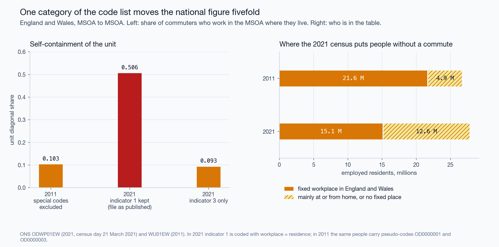
<figcaption aria-hidden="true">Figure 1. The 2021 place-of-work indicator and the diagonal share.</figcaption>
</figure>

### 4.2 Scale, contiguity, placement

| Partition           | Areas | Effective areas | $`SC`$ | Scale | Contiguity | Placement |
|---------------------|-------|-----------------|--------|-------|------------|-----------|
| 2011, own rules     | 197   | 16.4            | 0.740  | 0.157 | 0.408      | 0.175     |
| 2011, official TTWA | 173   | 35.2            | 0.749  | 0.128 | 0.415      | 0.205     |
| 2021, own rules     | 235   | 24.5            | 0.696  | 0.130 | 0.435      | 0.131     |
| 2021, official TTWA | 173   | 34.7            | 0.749  | 0.119 | 0.443      | 0.186     |

Own rules: after contiguity repair. The three parts sum to $`SC`$ (Eq. 5).

The closed form agrees with the permutations: 0.1303 against a mean of 0.1303 (standard deviation 0.0010) in 2021, and 0.1571 against 0.1571 in 2011.

Three observations. First, 235 areas behave under permutation like 24 equal ones, because one area holds 18 % of the units; the count of areas says little about scale. Second, contiguity is the largest part in every row. Random contiguous partitions of the same sizes reach 0.565 (standard deviation 0.009, maximum 0.586) where our delimitation reaches 0.696. Third, the raw scores of the official areas and of our heuristic differ by 0.749 − 0.740 in 2011, and their placement terms differ by 0.205 − 0.175. The official algorithm places boundaries better than the heuristic, and the raw score hides most of the difference.

At district level (331 units) the same rules give 9 areas with $`SC`$ = 0.947. The permutation null is 0.657 (standard deviation 0.008): 69 % of the score is scale. At MSOA level the share is 19 %. The higher score is the less informative one.

<figure>
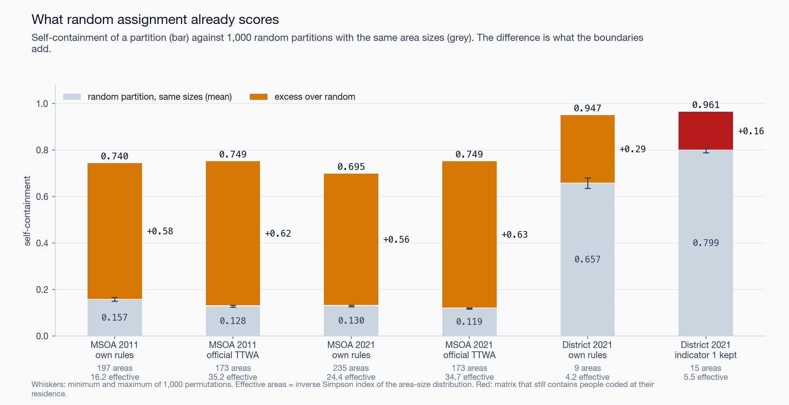
<figcaption aria-hidden="true">Figure 2. Self-containment against the permutation null, at two scales.</figcaption>
</figure>

<figure>
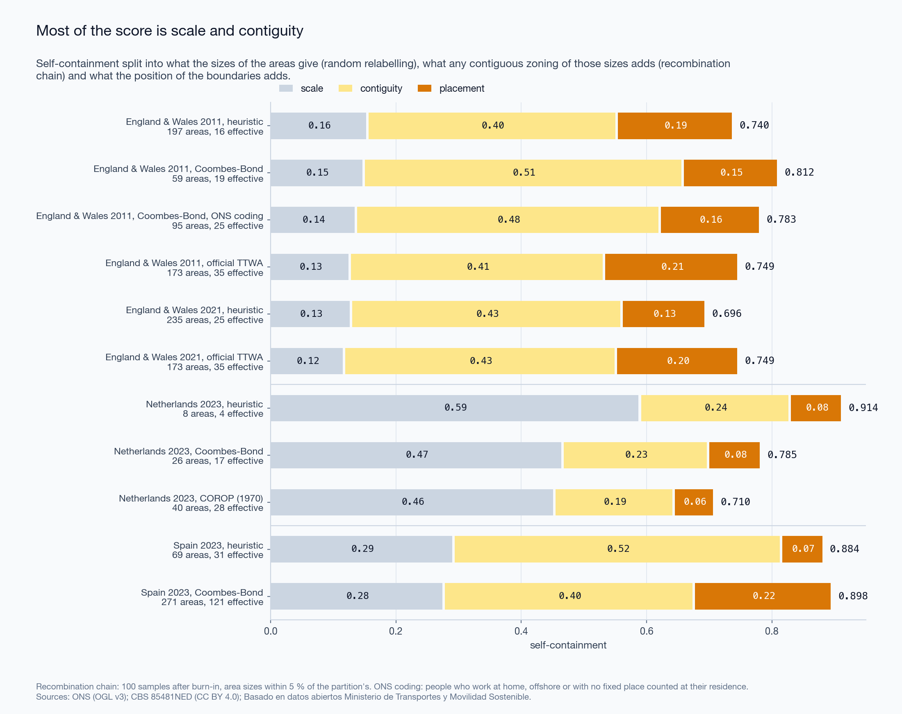
<figcaption aria-hidden="true">Figure 3. Decomposition of self-containment into scale, contiguity and placement.</figcaption>
</figure>

### 4.3 Placement: agreement with the official areas

| Partition                  | Areas | ARI  | Mean IoU | Median IoU | Mean IoU by area |
|----------------------------|-------|------|----------|------------|------------------|
| 2011, own rules            | 197   | 0.54 | 0.58     | 0.48       | 0.44             |
| 2011, rule by greedy merge | 67    | 0.46 | 0.48     | 0.23       | 0.37             |
| 2011, rule by dissolution  | 61    | 0.43 | 0.44     | 0.19       | 0.33             |
| 2021, own rules            | 235   | 0.64 | 0.60     | 0.47       | 0.43             |
| 2021, rule by greedy merge | 66    | 0.49 | 0.47     | 0.26       | 0.35             |
| 2021, rule by dissolution  | 46    | 0.17 | 0.28     | 0.14       | 0.26             |

Reference: the 173 official areas of 2011 that hold units of England or Wales (167 in England and Wales and 6 that cross a national border). Weights: employed residents, except in the last column.

Our 197 areas are close in number to the official 173, and the adjusted Rand index is 0.54. Enforcing the published rule does not bring the map closer to the official one. It leaves 67 areas by greedy merge and 61 by dissolution, and agreement falls to 0.46 and 0.43. Under greedy merge the London area holds 6.1 million employed residents, 28 % of England and Wales: each merge raises the pull of the area that absorbed, and the next weak area goes the same way. On the 2021 matrix dissolution ends with 46 areas, one of them with 45 % of employed residents.

Weighting by area instead of by people lowers the mean IoU in every row: agreement is worse in sparsely populated country than the people-weighted value shows.

**The same count from different rules.** Over a grid of 120 pairs $`(q,m)`$ the number of areas runs from 63 to 1,063. 4 pairs give between 223 and 247 areas; with three attachment thresholds each they give 12 maps. Their pairwise adjusted Rand index runs from 0.46 to 0.98, median 0.67; their agreement with the official areas from 0.54 to 0.68; their self-containment from 0.641 to 0.737. A count of areas near the official count is therefore not evidence of a similar map.

<figure>
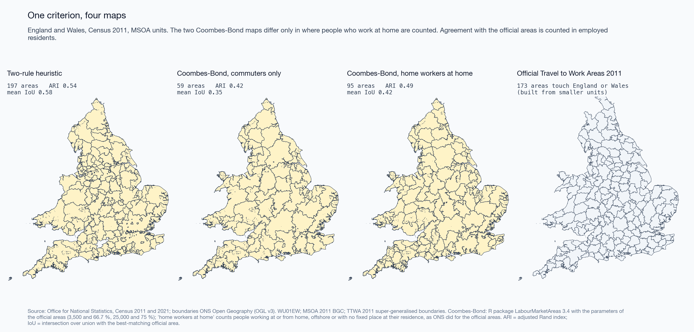
<figcaption aria-hidden="true">Figure 4. One matrix and one published criterion, three maps.</figcaption>
</figure>

<figure>
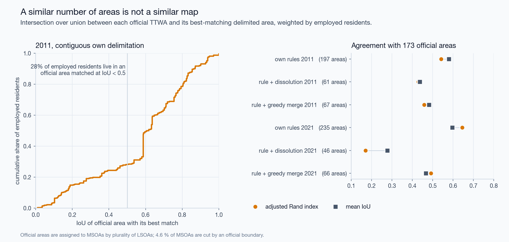
<figcaption aria-hidden="true">Figure 5. Agreement with the official areas.</figcaption>
</figure>

<figure>
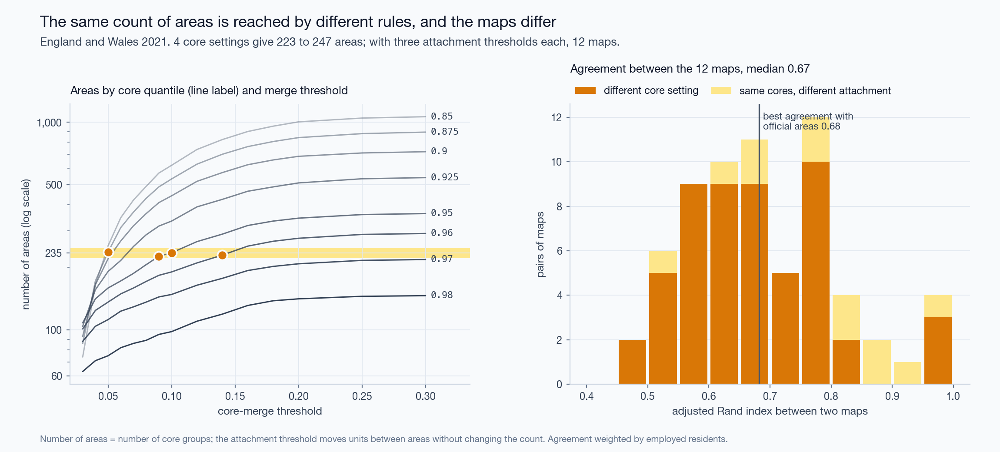
<figcaption aria-hidden="true">Figure 6. Maps with the same number of areas.</figcaption>
</figure>

### 4.4 Where the boundaries diverge

Six cases, all from the 2021 matrix (Figure 7).

1.  *Attachment without adjacency.* Flows alone leave 26 of 235 areas in more than one piece, with 79 units cut off. The largest piece is on the Wirral: it joins the Liverpool area across the Mersey, which the polygons do not cross and a tunnel does.
2.  *Repair.* After the repair the piece belongs to an adjacent area. Self-containment changes in the third decimal (0.695 to 0.696). The repair enforces polygon adjacency; in case 1 that may be the wrong model of the ground.
3.  *Islands.* 3 areas keep a piece, 13 units in all, that touches no unit of another area. Anglesey is one. Queen adjacency ends at the shore.
4.  *An official area inside a larger one.* The delimited London area contains whole official areas; for such an area omission is small and commission near 1.
5.  *An official area cut into several.* The best match holds less than half of the employed residents of the official area.
6.  *A unit the official boundary cuts.* 332 units lie in two or more official areas. No partition of MSOAs can reproduce the official map exactly.

<figure>
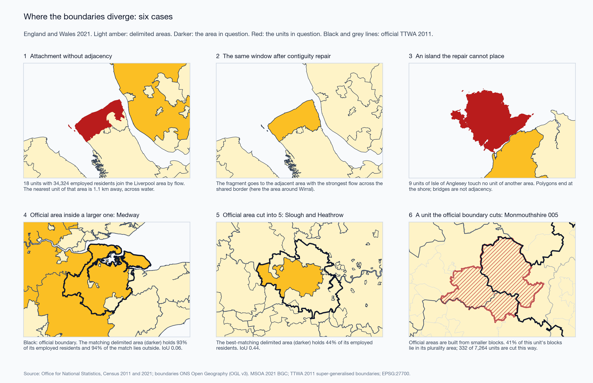
<figcaption aria-hidden="true">Figure 7. Six cases of boundary divergence.</figcaption>
</figure>

### 4.5 Bands without pairs: Serbia

The Serbian census publishes, per municipality, daily migrants by destination band: same municipality, another municipality of the same area, another area, abroad. 795,779 daily migrant workers live in 168 municipalities; 50.3 % stay in their municipality. Delimitation is not possible. Band self-containment is.

A daily migrant is a person who leaves the *settlement* of residence. 8 municipalities consist of one settlement, and their value is 0 by definition: the set of municipalities with value 0 and the set with one settlement are the same set. They are excluded from the statistics below and hatched on the map.

Over the other 160 municipalities the median is 0.53 for work and 0.65 for education; the median of the municipal differences is +0.08 (the difference of the medians is 0.12); the two series correlate at $`r`$ = 0.80. Education is the only non-work purpose in these sources, and it cannot be divided into school and university.

Urbanisation does not explain the difference: $`r`$ = +0.03 against the population share in urban classes. With the *area* share in urban classes, work self-containment correlates at $`r`$ = -0.28; with the population share at -0.02. The median area share is 0.014, so the Pearson coefficient rests on a few municipalities; the rank correlation is -0.11 for area and -0.04 for population.

The polygon file has lost its text encoding: every non-ASCII letter is a question mark. A join by pattern once matched a polygon of 587 km² outside the census territory to a Belgrade municipality. The join now resolves exact names first, accepts a pattern only if it is unique, and must be a bijection of 168 municipalities and 168 polygons.

<figure>
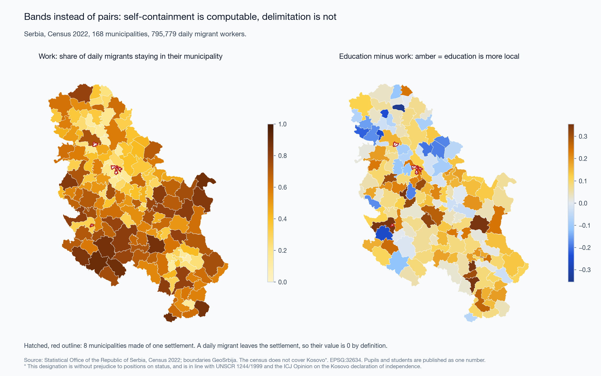
<figcaption aria-hidden="true">Figure 8. Serbia: band self-containment for work, and education minus work.</figcaption>
</figure>

<figure>
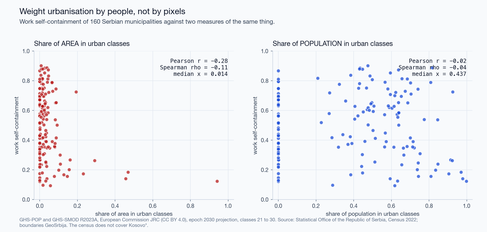
<figcaption aria-hidden="true">Figure 9. Work self-containment against urbanisation by area and by population.</figcaption>
</figure>

### 4.6 Pairs at the resolution of the answer: Netherlands

Table 81252NED holds 7.54 million jobs of December 2014 between 40 COROP regions, which were drawn in 1970 as commuter basins. The median supply-side self-containment is 0.66 (0.66 two-sided). 20 % of regions reach 0.75 on the supply side and 17.5 % two-sided. The range is from 0.45 (Zaanstreek) to 0.88 (Zuid-Limburg). Delimitation on the 40 nodes returns 2 areas. That number describes the resolution of the table. Basins cannot be redrawn from flows that are published only between the basins of 1970. Successor tables exist; the current one publishes pairs of municipalities and is not processed here.

<figure>
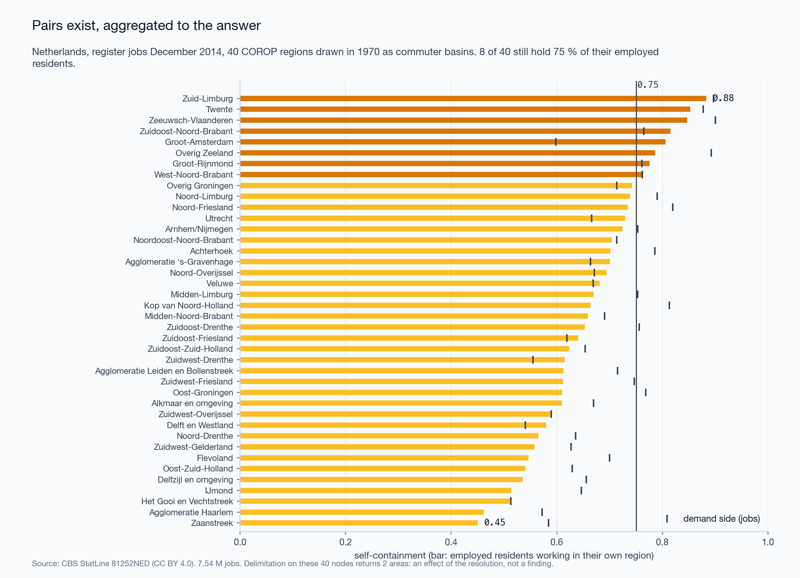
<figcaption aria-hidden="true">Figure 10. Netherlands: self-containment of 40 COROP regions.</figcaption>
</figure>

### 4.7 Time without pairs: Japan

The people-flow data give presence per 1 km cell by month, by weekday or holiday, and by day or night. The municipal product splits presence by where people live, in four nested rings. It is named “From-To” and holds no origins.

On a weekday of October 2019 in Naka-ku, the central ward of Hiroshima, 27 % of daytime presence is by residents of the ward; at night 68 %. Over 2,804 cells of the prefecture the median day/night ratio is 0.89, and 43 % of cells hold more people by day.

Totals of 2019, 2020 and 2021 agree within 0.11 %. The series is normalised; volumes cannot be compared between years. Composition can: the local share of weekday daytime presence in the prefecture is 0.632, 0.677 and 0.681.

**Signatures.** 4,011 cells have a full profile in 2019. With $`r`$ = 1.5 the shares are office 25 %, leisure 22 %, residential 16 %, mixed 37 %; entropy 1.34 nats, evenness 0.97. In the window of central Hiroshima, 422 cells have a profile volume of 100 or more: 115 office, 102 residential, 50 leisure, 155 mixed. Two rules hold at once in 18 % of cells, so the order of the rules matters.

**Clusterability.** On the four-slot composition HDBSCAN labels every cell as noise at 9 of 12 settings; at the others it finds 2 to 8 clusters and 30 to 54 % noise. On the two axes it never labels all cells as noise: the noise share runs from 4 to 93 %, and at the loosest setting one cluster holds 95 % of cells. No setting returns a partition that resembles four classes. The Hopkins statistic is 0.99: the cells are concentrated, which one dense mode also produces. The silhouette of k-means is 0.42 at best ($`k`$ = 2) and 0.36 for $`k`$ = 4.

**Thresholds.** As $`r`$ goes from 1.25 to 2 the share of mixed cells goes from 17 % to 65 %. The classes are declared on two named axes. They are not discovered.

<figure>
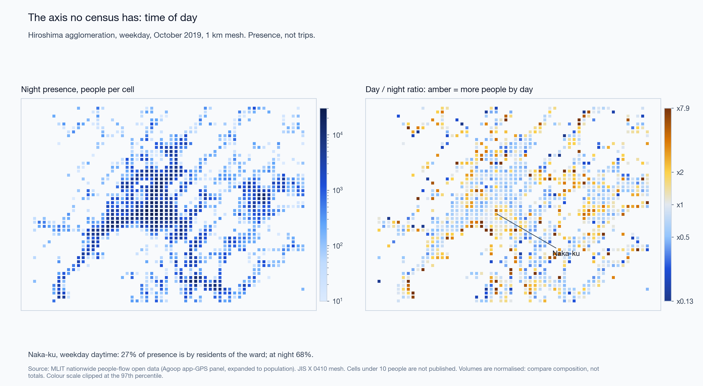
<figcaption aria-hidden="true">Figure 11. Hiroshima: night presence and the day/night ratio.</figcaption>
</figure>

<figure>
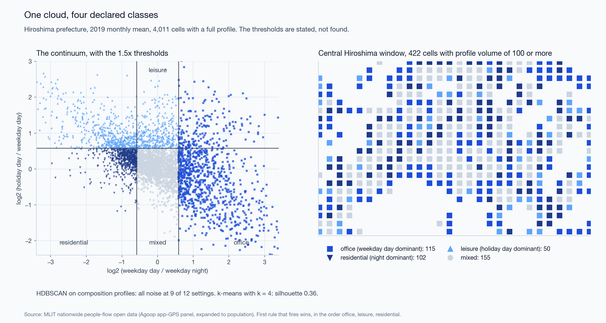
<figcaption aria-hidden="true">Figure 12. Temporal signatures: the cloud and the map.</figcaption>
</figure>

<figure>
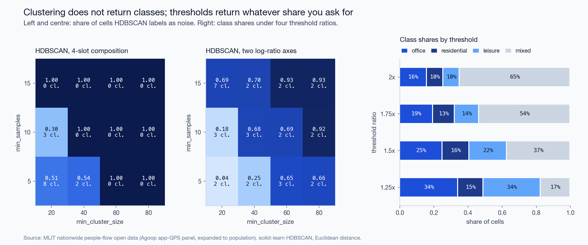
<figcaption aria-hidden="true">Figure 13. HDBSCAN noise share by setting, and class shares by threshold.</figcaption>
</figure>

### 4.8 Traces of contributors: OpenStreetMap

| Window | Points | Distinct minutes | Median year | Share in busiest cell | Spearman with Overture places |
|----|----|----|----|----|----|
| Hiroshima | 200,000 | 2,395 | 2022 | 50 % | +0.79 ($`n`$ = 23) |
| Belgrade | 200,000 | 5,695 | 2014 | 35 % | +0.72 ($`n`$ = 19) |
| London, Soho | 185,000 | 10,278 | 2016 | 23 % | not computed |

200,000 is the limit of the request. The sample is a few thousand minutes of recording, half of it in one cell in Hiroshima, most of it twelve years old in Belgrade.

Do the traces follow people or mapped places? In Hiroshima 11 cells have traces, presence and places. The rank correlation of traces with daytime presence is +0.72 (95 % interval +0.19 to +0.92) and with places +0.61 (-0.00 to +0.89). The intervals overlap almost entirely. The windows are too small to answer the question; presence and places themselves correlate at +0.79 over 131 cells of the city.

<figure>
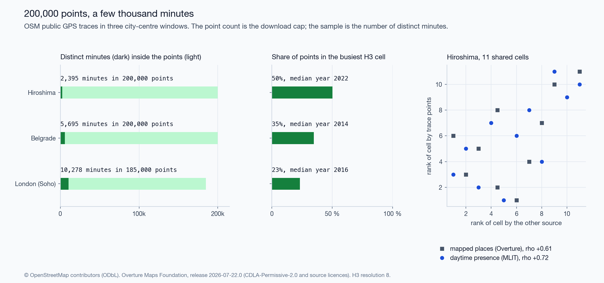
<figcaption aria-hidden="true">Figure 14. OSM public GPS traces in three windows.</figcaption>
</figure>

### 4.9 Audit of the deck of the talk

The deck prepared for the talk carried 56 numbers. The pipeline reproduces 46 within the rounding of the slide. The other 10:

- 2 were computed on the 2021 matrix before people coded at their residence were removed (district-level score 0.961 and null 0.798; corrected 0.947 and 0.657).
- 3 are right numbers under wrong names: the two extreme Dutch regions, and a correlation of −0.28 that belongs to work self-containment and was shown for the education-work difference.
- 1 held for part of the settings and was stated without the condition (HDBSCAN, “100 % noise”).
- 4 differ from the slide beyond its rounding. For one of them no variant of the computation gives the slide value ($`r`$ = 0.82 for work against education; the pipeline gives 0.80).

The deck also named the provider of the Japanese data wrongly and called a Dutch table discontinued without its successors. The register is `docs/RESULTS.md`; the list of corrections is `docs/ERRATA.md`.

## 5 Discussion

**Self-containment needs two baselines.** Eq. 4 costs nothing to compute and removes the scale effect. It shows why scores at different unit systems cannot be compared: $`d`$ alone is 0.55 for districts. The contiguous null is dearer and tells more. In all four rows of Section 4.2 contiguity accounts for more than half of the score. A delimitation algorithm competes for the remaining part, between 0.13 and 0.21 here, and it is on this part that algorithms should be compared.

**Relation to modularity.** Directed modularity ([Leicht and Newman 2008](#ref-leicht2008); [Newman and Girvan 2004](#ref-newman2004)) subtracts a null that keeps the outflow and inflow of every unit, and so discounts strong attractors. The permutation null keeps the sizes of the areas and discounts scale. They answer different questions; modularity of our 2021 partition is 0.66. Modularity has been used to build functional regions ([Farmer and Fotheringham 2011](#ref-farmer2011)); Eq. 5 is a way to judge regions built by any method.

**A criterion is not a construction.** The validity rule of the official areas is public and simple. Two procedures that both end with valid areas only give 61 to 67 areas where the official map has 173, and agree with it less than the unrepaired heuristic does. What draws the official boundaries is the order in which units are taken apart and reassigned. The count of areas and the raw score would not have shown this; the error matrix does.

**What each source can answer.**

| Question | Source that can answer it | Check before use |
|----|----|----|
| Delimitation, commuting structure | Census or register pairs at fine units (England and Wales; municipal pairs where published) | Codes for people without a commute; both nulls; contiguity; census date |
| Self-containment where no pairs exist | Destination bands (Serbia) | Definition of the migrant; units of one settlement |
| Presence by time of day | Panel or operator products (Japan; Spain) | Who is in the panel; normalisation of volume; suppression threshold; meaning of “from” |
| Routes of individual recordings | OSM public traces | Distinct minutes, not points; concentration; age of traces |

**Comparison with earlier cross-checks.** Lenormand et al. ([2014](#ref-lenormand2014)) found that mobile phone, social media and census sources agree on aggregate flows in two Spanish cities. Our result does not contradict theirs. It concerns the step after the flows: partitions built on one matrix by rules of the same family already disagree at an adjusted Rand index of 0.67.

## 6 Limitations

1.  **One country with pairs.** Sections 4.2 to 4.4 rest on England and Wales. The decomposition is general; the magnitudes are not shown to be.
2.  **The 2021 census day.** 21 March 2021 was a lockdown day. People with a fixed workplace on that day are not a random part of the workforce. Statements about commuting use 2011.
3.  **Units and official blocks.** Official areas are assigned to MSOAs by plurality; 332 units are cut. Agreement values carry this error and cannot reach 1.
4.  **The contiguous null is approximate.** Region growing does not sample contiguous partitions uniformly, and walled-in regions miss their size: the random partitions have 35 effective areas where the delimitation has 24. With sizes as unequal as those of the delimitation the random partitions would hold more flow, so the contiguity part is if anything understated and the placement part overstated.
5.  **The official algorithm was not run.** We compare with its output. The open implementation of the European method (R package `LabourMarketAreas`) was not run either.
6.  **Eq. 6 is our reading.** The publication gives the two end points of the trade-off. The linear form between them is an assumption, and size is measured by employed residents in the matrix, not by the economically active population.
7.  **The trace test has no power.** Eleven shared cells; three small windows; the archive behind the API changes daily.
8.  **GHSL epoch.** The rasters are the 2030 projection of release R2023A. Their population over the 168 municipalities is 6.87 million, about 3 % above the census.
9.  **The Japanese panel.** Who is in the panel and how it is expanded is not published. Cells under 10 people are absent, which removes sparsely populated cells from every ratio.
10. **Thresholds are choices.** $`q`$, $`m`$, $`t`$, the ratio $`r`$ and the minimum of 100 are declared values. Section 4.3 and Figure 13 show what moves when they move.
11. **Release retention.** The Overture release used has left the public bucket. The aggregate is archived in the repository; the extract cannot be drawn again. The same script on release 2026-08-19.0 gives 252 cells in Hiroshima where the archived release gave 254.
12. **No operator data.** The Spanish hourly matrices would give the European case of time and pairs together. They are not processed.

## 7 Future work

- Run the open European labour-market-area algorithm on the 2011 matrix and place it in the decomposition of Section 4.2 beside the heuristic and the official map.
- Replace region growing by a sampler with a known distribution over contiguous partitions (spanning-tree methods) and report the null as a distribution with exact size constraints.
- Dutch municipal pairs from the successor table: the full sequence of Section 4.2 to 4.4 for a second country.
- Madrid from the Spanish hourly matrices: pairs and time in one source, and hourly profiles in place of day and night.
- Japanese census commuting pairs for Hiroshima, to set band-based presence beside pair-based commuting in one city.
- Larger trace windows, so that the test of Section 4.8 has power.
- GHSL epoch 2020.

## 8 Conclusion

Open sources of mobility differ in what they omit, and the omission is found in the code list and the definitions, not in the file. Where pairs exist, most of the self-containment of a functional-area map is produced by the sizes of the areas and by their contiguity. The part that depends on the position of the boundaries is 0.13 to 0.21 of a score of about 0.7. That part, and an error matrix against a reference counted in people, are what we propose to report with any delimitation.

## Data and code availability

Code (MIT), text and figures (CC BY 4.0), parameters, tests and result tables: <https://github.com/m-erts/urban-functional-maps>. Input data are open and are fetched from their publishers; `data/manifest.yaml` lists address, licence and checksum of every file. `make all` regenerates every table, figure and number.

## Statements

**Funding.** None. **Competing interests.** None declared. **Use of AI tools.** The code was written and the text drafted with the assistance of a large language model (Claude, Anthropic). The author reviewed the code, the results and the text and is responsible for them. **Kosovo\*.** The 2022 census of Serbia does not cover Kosovo\*. \* This designation is without prejudice to positions on status, and is in line with UNSCR 1244/1999 and the ICJ Opinion on the Kosovo declaration of independence.

## References

<div id="refs" class="references csl-bib-body hanging-indent">

<div id="ref-adolfsson2019" class="csl-entry">

Adolfsson, Andreas, Margareta Ackerman, and Naomi C. Brownstein. 2019. “To Cluster, or Not to Cluster: An Analysis of Clusterability Methods.” *Pattern Recognition* 88: 13–26. <https://doi.org/10.1016/j.patcog.2018.10.026>.

</div>

<div id="ref-ahas2010" class="csl-entry">

Ahas, Rein, Siiri Silm, Olle Järv, Erki Saluveer, and Margus Tiru. 2010. “Using Mobile Positioning Data to Model Locations Meaningful to Users of Mobile Phones.” *Journal of Urban Technology* 17 (1): 3–27. <https://doi.org/10.1080/10630731003597306>.

</div>

<div id="ref-campello2013" class="csl-entry">

Campello, Ricardo J. G. B., Davoud Moulavi, and Joerg Sander. 2013. “Density-Based Clustering Based on Hierarchical Density Estimates.” In *Advances in Knowledge Discovery and Data Mining: 17th Pacific-Asia Conference, PAKDD 2013, Gold Coast, Australia, April 14-17, 2013, Proceedings, Part II*, edited by Jian Pei, Vincent S. Tseng, Longbing Cao, Hiroshi Motoda, and Guandong Xu, vol. 7819. Lecture Notes in Computer Science. Springer Berlin Heidelberg. <https://doi.org/10.1007/978-3-642-37456-2_14>.

</div>

<div id="ref-casado2011" class="csl-entry">

Casado-Díaz, José M., and Mike Coombes. 2011. “The Delineation of 21st Century Local Labour Market Areas: A Critical Review and a Research Agenda.” *Boletín de La Asociación de Geógrafos Españoles*, no. 57: 7–32. <https://bage.age-geografia.es/ojs/index.php/bage/article/view/1390>.

</div>

<div id="ref-congalton1991" class="csl-entry">

Congalton, Russell G. 1991. “A Review of Assessing the Accuracy of Classifications of Remotely Sensed Data.” *Remote Sensing of Environment* 37 (1): 35–46. <https://doi.org/10.1016/0034-4257(91)90048-B>.

</div>

<div id="ref-coombes1986" class="csl-entry">

Coombes, M. G., A. E. Green, and S. Openshaw. 1986. “An Efficient Algorithm to Generate Official Statistical Reporting Areas: The Case of the 1984 <span class="nocase">Travel-to-Work Areas</span> Revision in Britain.” *Journal of the Operational Research Society* 37 (10): 943–53. <https://doi.org/10.1057/jors.1986.163>.

</div>

<div id="ref-coombes2008" class="csl-entry">

Coombes, Mike, and Steve Bond. 2008. *Travel-to-Work Areas: The 2007 Review*. Office for National Statistics.

</div>

<div id="ref-dijkstra2021" class="csl-entry">

Dijkstra, Lewis, Aneta J. Florczyk, Sergio Freire, et al. 2021. “Applying the <span class="nocase">Degree of Urbanisation</span> to the Globe: A New Harmonised Definition Reveals a Different Picture of Global Urbanisation.” *Journal of Urban Economics* 125: 103312. <https://doi.org/10.1016/j.jue.2020.103312>.

</div>

<div id="ref-dijkstra2019" class="csl-entry">

Dijkstra, Lewis, Hugo Poelman, and Paolo Veneri. 2019. *The EU-OECD Definition of a Functional Urban Area*. OECD Regional Development Working Papers 2019/11. OECD Publishing. <https://doi.org/10.1787/d58cb34d-en>.

</div>

<div id="ref-multimno" class="csl-entry">

Eurostat. 2025. *Multi-MNO Project: Open-Source Reference Pipeline for Statistics from Mobile Network Operator Data*. <https://github.com/eurostat/multimno>.

</div>

<div id="ref-farmer2011" class="csl-entry">

Farmer, Carson J Q, and A Stewart Fotheringham. 2011. “Network-Based Functional Regions.” *Environment and Planning A* 43 (11): 2723–41. <https://doi.org/10.1068/a44136>.

</div>

<div id="ref-fotheringham1991" class="csl-entry">

Fotheringham, A S, and D W S Wong. 1991. “The Modifiable Areal Unit Problem in Multivariate Statistical Analysis.” *Environment and Planning A* 23 (7): 1025–44. <https://doi.org/10.1068/a231025>.

</div>

<div id="ref-franconi2017" class="csl-entry">

Franconi, Luisa, Daniela Ichim, and Michele D’Aló. 2017. “Labour Market Areas for Territorial Policies: Tools for a European Approach.” *Statistical Journal of the IAOS* 33 (3): 585–91. <https://doi.org/10.3233/SJI-160343>.

</div>

<div id="ref-hill1973" class="csl-entry">

Hill, M. O. 1973. “Diversity and Evenness: A Unifying Notation and Its Consequences.” *Ecology* 54 (2): 427–32. <https://doi.org/10.2307/1934352>.

</div>

<div id="ref-hopkins1954" class="csl-entry">

Hopkins, Brian, and J. G. Skellam. 1954. “A New Method for Determining the Type of Distribution of Plant Individuals.” *Annals of Botany* 18 (2): 213–27. <https://doi.org/10.1093/oxfordjournals.aob.a083391>.

</div>

<div id="ref-hubert1985" class="csl-entry">

Hubert, Lawrence, and Phipps Arabie. 1985. “Comparing Partitions.” *Journal of Classification* 2 (1): 193–218. <https://doi.org/10.1007/BF01908075>.

</div>

<div id="ref-iso19157" class="csl-entry">

International Organization for Standardization. 2013. *ISO 19157:2013 Geographic Information – Data Quality*. ISO.

</div>

<div id="ref-jaccard1912" class="csl-entry">

Jaccard, Paul. 1912. “The Distribution of the Flora in the Alpine Zone.” *New Phytologist* 11 (2): 37–50. <https://doi.org/10.1111/j.1469-8137.1912.tb05611.x>.

</div>

<div id="ref-jost2006" class="csl-entry">

Jost, Lou. 2006. “Entropy and Diversity.” *Oikos* 113 (2): 363–75. <https://doi.org/10.1111/j.2006.0030-1299.14714.x>.

</div>

<div id="ref-kotov2026" class="csl-entry">

Kotov, Egor, Eugeni Vidal-Tortosa, Oliva G. Cantú-Ros, et al. 2026. “<span class="nocase">spanishoddata</span>: A Package for Accessing and Working with Spanish Open Mobility Big Data.” *Environment and Planning B: Urban Analytics and City Science* 53 (6): 1398–410. <https://doi.org/10.1177/23998083251415040>.

</div>

<div id="ref-leicht2008" class="csl-entry">

Leicht, E. A., and M. E. J. Newman. 2008. “Community Structure in Directed Networks.” *Physical Review Letters* 100 (11): 118703. <https://doi.org/10.1103/PhysRevLett.100.118703>.

</div>

<div id="ref-lenormand2014" class="csl-entry">

Lenormand, Maxime, Miguel Picornell, Oliva G. Cantú-Ros, et al. 2014. “Cross-Checking Different Sources of Mobility Information.” *PLoS ONE* 9 (8): e105184. <https://doi.org/10.1371/journal.pone.0105184>.

</div>

<div id="ref-martinez2012" class="csl-entry">

Martínez-Bernabeu, Lucas, Francisco Flórez-Revuelta, and José Manuel Casado-Díaz. 2012. “Grouping Genetic Operators for the Delineation of Functional Areas Based on Spatial Interaction.” *Expert Systems with Applications* 39 (8): 6754–66. <https://doi.org/10.1016/j.eswa.2011.12.026>.

</div>

<div id="ref-mlit2021" class="csl-entry">

Ministry of Land, Infrastructure, Transport and Tourism of Japan. 2021. *Nationwide People-Flow Open Data (1 Km Mesh, by Municipality of Residence Ring), 2019–2021*. <https://www.geospatial.jp/ckan/dataset/mlit-1km-fromto>.

</div>

<div id="ref-newman2004" class="csl-entry">

Newman, M. E. J., and M. Girvan. 2004. “Finding and Evaluating Community Structure in Networks.” *Physical Review E* 69 (2): 026113. <https://doi.org/10.1103/PhysRevE.69.026113>.

</div>

<div id="ref-oecd2012" class="csl-entry">

OECD. 2012. *Redefining “Urban”: A New Way to Measure Metropolitan Areas*. OECD Publishing. <https://doi.org/10.1787/9789264174108-en>.

</div>

<div id="ref-ons2014wu01" class="csl-entry">

Office for National Statistics. 2014. *2011 Census: Origin-Destination Data, Table WU01EW, Location of Usual Residence and Place of Work*. <https://www.nomisweb.co.uk/census/2011/wu01ew>.

</div>

<div id="ref-ons2022quality" class="csl-entry">

Office for National Statistics. 2022. *Travel to Work Quality Information for Census 2021*. <https://www.ons.gov.uk/employmentandlabourmarket/peopleinwork/employmentandemployeetypes/methodologies/traveltoworkqualityinformationforcensus2021>.

</div>

<div id="ref-ons2023od" class="csl-entry">

Office for National Statistics. 2023. *User Guide to Census 2021 Origin-Destination Data, England and Wales*. <https://www.ons.gov.uk/peoplepopulationandcommunity/populationandmigration/populationestimates/methodologies/userguidetocensus2021origindestinationdataenglandandwales>.

</div>

<div id="ref-ons2016ttwa" class="csl-entry">

Office for National Statistics, and Mike Coombes. 2016. *Travel to Work Area Analysis in Great Britain: 2016*. Office for National Statistics. <https://www.ons.gov.uk/employmentandlabourmarket/peopleinwork/employmentandemployeetypes/articles/traveltoworkareaanalysisingreatbritain/2016>.

</div>

<div id="ref-openshaw1984" class="csl-entry">

Openshaw, Stan. 1984. *The Modifiable Areal Unit Problem*. Concepts and Techniques in Modern Geography 38. Geo Books.

</div>

<div id="ref-osmtraces" class="csl-entry">

OpenStreetMap contributors. 2026. *Public GPS Traces, Retrieved Through the OpenStreetMap API V0.6*. <https://www.openstreetmap.org/traces>.

</div>

<div id="ref-overture2026" class="csl-entry">

Overture Maps Foundation. 2026. *Overture Maps Places, Release 2026-07-22.0*. <https://docs.overturemaps.org/guides/places/>.

</div>

<div id="ref-ratti2010" class="csl-entry">

Ratti, Carlo, Stanislav Sobolevsky, Francesco Calabrese, et al. 2010. “Redrawing the Map of Great Britain from a Network of Human Interactions.” *PLoS ONE* 5 (12): e14248. <https://doi.org/10.1371/journal.pone.0014248>.

</div>

<div id="ref-ricciato2020" class="csl-entry">

Ricciato, Fabio, Giampaolo Lanzieri, Albrecht Wirthmann, and Gerdy Seynaeve. 2020. “Towards a Methodological Framework for Estimating Present Population Density from Mobile Network Operator Data.” *Pervasive and Mobile Computing* 68: 101263. <https://doi.org/10.1016/j.pmcj.2020.101263>.

</div>

<div id="ref-rosenberg2007" class="csl-entry">

Rosenberg, Andrew, and Julia Hirschberg. 2007. “V-Measure: A Conditional Entropy-Based External Cluster Evaluation Measure.” In *Proceedings of the 2007 Joint Conference on Empirical Methods in Natural Language Processing and Computational Natural Language Learning (EMNLP-CoNLL)*, edited by Jason Eisner. Association for Computational Linguistics. <https://aclanthology.org/D07-1043/>.

</div>

<div id="ref-ghspop2023" class="csl-entry">

Schiavina, Marcello, Sergio Freire, Alessandra Carioli, and Kytt MacManus. 2023. *GHS-POP R2023A - GHS Population Grid Multitemporal (1975-2030)*. Dataset; European Commission, Joint Research Centre (JRC). <https://doi.org/10.2905/2FF68A52-5B5B-4A22-8F40-C41DA8332CFE>.

</div>

<div id="ref-ghssmod2023" class="csl-entry">

Schiavina, Marcello, Michele Melchiorri, and Martino Pesaresi. 2023. *GHS-SMOD R2023A - GHS Settlement Layers, Application of the <span class="nocase">Degree of Urbanisation</span> Methodology (Stage I) to GHS-POP R2023A and GHS-BUILT-S R2023A, Multitemporal (1975-2030)*. Dataset; European Commission, Joint Research Centre (JRC). <https://doi.org/10.2905/A0DF7A6F-49DE-46EA-9BDE-563437A6E2BA>.

</div>

<div id="ref-sors2024" class="csl-entry">

Statistical Office of the Republic of Serbia. 2024. *2022 Census of Population, Households and Dwellings: Daily Migrations*. <https://popis2022.stat.gov.rs/sr-latn/popisni-podaci-eksel-tabele/>.

</div>

<div id="ref-cbs81252" class="csl-entry">

Statistics Netherlands (CBS). 2016. *Banen van Werknemers; Geslacht, Leeftijd, Woon- En Werkregio’s (2006–2014), Table 81252NED*. <https://opendata.cbs.nl/statline/#/CBS/nl/dataset/81252NED>.

</div>

<div id="ref-toole2012" class="csl-entry">

Toole, Jameson L., Michael Ulm, Marta C. González, and Dietmar Bauer. 2012. “Inferring Land Use from Mobile Phone Activity.” *Proceedings of the ACM SIGKDD International Workshop on Urban Computing* (New York, NY, USA), 1–8. <https://doi.org/10.1145/2346496.2346498>.

</div>

<div id="ref-wong2009" class="csl-entry">

Wong, David. 2009. “The Modifiable Areal Unit Problem (MAUP).” In *The SAGE Handbook of Spatial Analysis*, edited by A. Stewart Fotheringham and Peter A. Rogerson. SAGE Publications, Ltd. <https://doi.org/10.4135/9780857020130.n7>.

</div>

</div>
