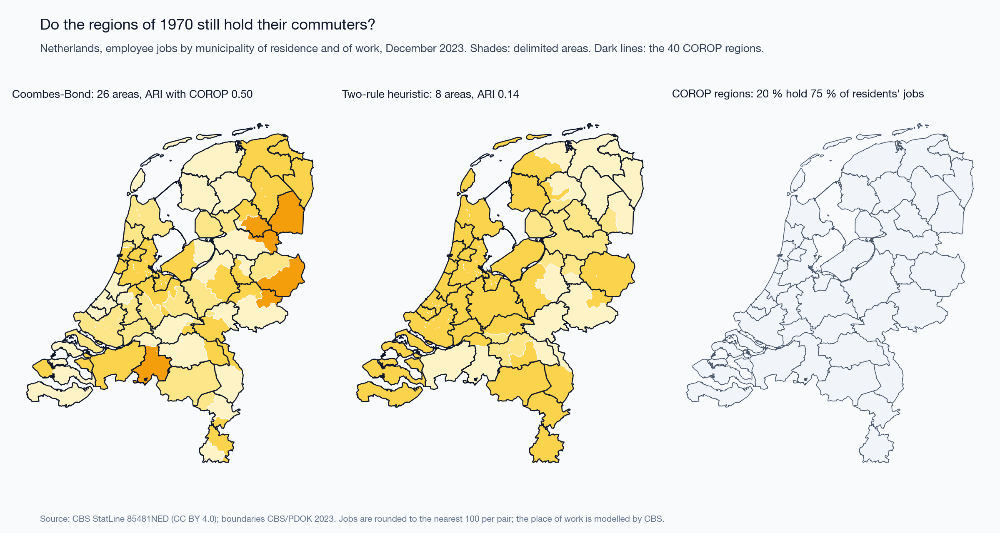
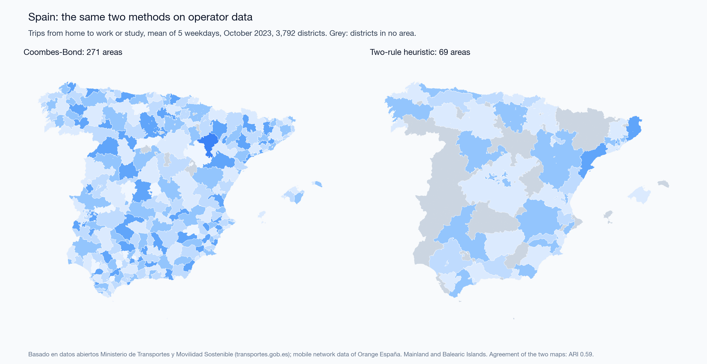
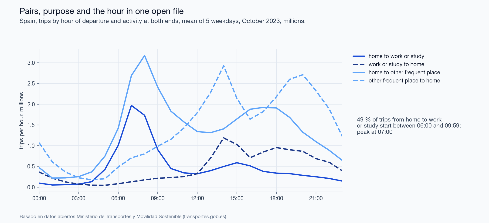

**Prepared for:** FOSS4G 2026, Hiroshima, as the talk "Eurostat vs OSM vs Census: Choosing Open Mobility Data for Urban Function Maps". The talk was accepted and the session was cancelled; the material is published here in full.
**Code, parameters and every number of this text:** <https://github.com/m-erts/urban-functional-maps>

## Abstract

Functional areas are drawn from flows of people, and open sources of such flows differ in what they publish: origin-destination pairs, the purpose of the trip, the time of day. We audit six open sources in five countries. For the three that publish pairs between fine units (census commuting in England and Wales, register jobs between Dutch municipalities, and trips between Spanish districts inferred from mobile network data) we measure how much of a functional-area map comes from the coding of the source, from the scale and contiguity of the zoning, and from the construction that places the boundaries. (1) In the 2021 census of England and Wales 12.6 million people without a commute are coded with workplace equal to residence; keeping them raises the share of within-unit commuting from 0.093 to 0.506. (2) The self-containment expected when units are relabelled at random has a closed form, $d+(1-d)h$, where $d$ is the diagonal share of the unit system and $h$ the Simpson concentration of area sizes. A recombination Markov chain on spanning trees gives a second baseline: contiguous partitions with the same sizes. Over 11 partitions in three countries, the part of self-containment that depends on where the boundaries run is 0.06 to 0.22. Scale takes the largest part on Dutch municipalities, contiguity on English neighbourhoods. (3) The Coombes-Bond algorithm with the parameters of the official Travel to Work Areas gives 59 areas on the open 2011 matrix of commuters. Counting people who work at home at their residence, as the statistical office did, raises this to 95; the official map has 173. Of the Dutch COROP regions designed in 1970, 45 % meet the same validity rule on the pairs of 2023. (4) Temporal profiles of presence in Hiroshima form one cloud, so functional classes drawn from them are declared, not found. Every number in the text is produced by an open pipeline. Of the 56 numbers in the first version of the conference slides, 46 are reproduced and 10 are corrected.

**Keywords:** functional urban areas; travel-to-work areas; labour market areas; modifiable areal unit problem; self-containment; null model; recombination Markov chain; origin-destination data; mobile phone data; reproducibility

## 1 Introduction

Labour-market areas and functional urban areas are partitions of a territory into zones inside which most people both live and work. Official products are built from census commuting matrices with published rules. Examples are the Travel to Work Areas (TTWA) of the United Kingdom [@coombes1986; @coombes2008], the EU-OECD functional urban areas [@oecd2012; @dijkstra2019], and the labour market areas that European statistical offices build with the TTWA method [@franconi2017; @eurostat2020lma]. Mobile phone records added non-work trips and time of day to this work [@ratti2010; @ahas2010; @toole2012]. Operator data are usually sold, but Spain publishes daily origin-destination matrices derived from them [@kotov2026]. This paper asks what can be done with sources that anyone can download.

Two problems stand in the way, and they are of different kinds.

The first is in the sources. Each open source publishes some of three things and omits the rest: origin-destination pairs, the purpose of the trip, the time of day. The omission is not an error in the file. ISO 19157 [@iso19157] defines computable elements of data quality: completeness, logical consistency, positional accuracy. A file can pass all of them and still answer a different question from the one the analyst puts to it. ISO 19157 calls the remaining element usability and leaves it to the user. A file named "From-To" that holds no origins is an example (Section 4.6).

The second is in the method. Delimitations are judged by self-containment, which rises when areas become larger or fewer. This is the scale effect of the modifiable areal unit problem [@openshaw1984; @fotheringham1991; @wong2009]. Take a score of 0.95 at district level and a score of 0.70 at neighbourhood level. They cannot be compared until one knows what an arbitrary partition scores at each level. Delimitation algorithms differ as well [@casado2011; @martinez2012; @farmer2011]. An official product is defined by its algorithm, and its publication describes the acceptance criterion in more detail than the construction. The reference construction is the algorithm of Coombes and Bond [-@coombes2008], of which an open implementation exists [@lma_package].

We put three questions and a smaller fourth.

- **Q1.** Which of the three dimensions does each open source publish, and what happens to a standard indicator when the missing one is ignored?
- **Q2.** How much of the self-containment of a partition comes from the number and sizes of its areas, how much from their contiguity, and how much from the position of the boundaries? Does the split change between countries and unit systems?
- **Q3.** Take partitions built from one matrix under one validity rule by different constructions. How far apart are they, and how close does the standard construction come to an official map?
- **Q4.** Studies of phone data often cluster temporal profiles of presence and name the clusters as land uses [@soto2011; @lenormand2015]. Do the profiles support that step?

Q3 compares constructions. It does not judge the position of official boundaries: those were drawn from finer units than the open matrices and revised after the algorithm ran [@ons2016ttwa; @coombes2015].

The contributions are these. A closed form for the permutation null of partition self-containment (Eq. 4), which reduces the scale effect to two numbers. A three-part decomposition of self-containment into scale, contiguity and placement (Eq. 5), in which the contiguous baseline is drawn by a recombination chain that holds the sizes of the areas; it is applied to 11 partitions in three countries. A comparison of three constructions under one validity rule, one of them the standard Coombes-Bond algorithm with official parameters, run on two codings of the same matrix. The comparison uses a spatial error matrix weighted by employed residents (Section 3.7). A record of a coding change between two censuses that moves a national indicator fivefold. A pipeline in which every number of the text is a test target.

## 2 Data

| Source | Territory and period | Units | Pairs | Purpose | Time | Licence |
|---|---|---|---|---|---|---|
| ONS WU01EW [@ons2014wu01] | England and Wales, census of 27 March 2011 | 7,201 MSOA | full matrix; special workplaces as pseudo-codes | work | none | OGL v3 |
| ONS ODWP01EW [@ons2023od] | England and Wales, census of 21 March 2021 | 7,264 MSOA | full matrix with a place-of-work indicator | work | none | OGL v3 |
| CBS 85481NED [@cbs85481ned] | Netherlands, December 2023 | 342 municipalities | full matrix, to the nearest 100 jobs | jobs of employees | none | CC BY 4.0 |
| MITMS open mobility study [@mitms2024metodologia] | Spain, 5 weekdays of October 2023 | 3,792 districts | full matrix of trips | activity at both ends: home, work or study, other frequent place, other | hour of departure | ministry open-data licence |
| CBS 81252NED [@cbs81252] | Netherlands, December 2014 | 40 COROP regions | 40 x 40 | jobs of employees | none | CC BY 4.0 |
| SORS daily migrations [@sors2024] | Serbia, census 2022 | 168 municipalities | none: four nested destination bands | work; education (pupils and students as one number) | none | SORS terms |
| MLIT people flow [@mlit2021] | Japan, Hiroshima prefecture, monthly 2019 to 2021 | 1 km mesh; 30 municipalities | none: four nested residence rings | none: presence | month x weekday or holiday x day or night | Government of Japan Standard Terms of Use 2.0 |
| OSM public GPS traces [@osmtraces] | central Hiroshima, Belgrade, London | points | trajectories of contributors | none | timestamps | ODbL |

Three sources publish pairs between fine units: England and Wales, the Netherlands from 2021, and Spain. They carry Sections 4.2 and 4.3.

*Netherlands, 2023.* Table 85481NED counts employee jobs in December, not persons, by municipality of residence and municipality of work. CBS models the place of work from the establishments of the employer, and all figures are provisional [@cbs85481ned]. Pairs are published in thousands with one decimal. A pair is therefore known to the nearest 100 jobs, and pairs under 50 appear as zero. The rounded pairs between municipalities retain 95.6 % of the jobs of Dutch residents (median municipality 93.7 %, smallest 56 %). Jobs in an unknown municipality (295,600) are dropped. The reference partition is the 40 COROP regions. CBS describes them as designed in 1970, each a central city with its surrounding area [@cbs85481ned]. COROP regions are unions of municipalities; each municipality is assigned to the region that contains its representative point.

*Spain, 2023.* The Ministry of Transport publishes daily matrices of trips between 3,909 zones [@mitms2024metodologia; @kotov2026]. In Spain, 3,792 zones are municipalities, groups of small municipalities, and census districts of large cities; the other 117 are NUTS-3 regions of France and Portugal. Each trip carries the hour of departure and the activity at both ends. Activities and trips are inferred from the mobile network data of Orange España and expanded to the resident population by district, age and sex. Trips shorter than 500 m are not counted. We average five weekdays: 17 to 19 and 24 to 25 October 2023. 26 October is not published because of an incident at the operator. We keep trips from home to a place of work or study whose destination is not flagged as a possible place of study, 11.31 million trips a day between 3,744 zones. These are trips, not persons, and the category mixes work with some study. It is the only source in this study that publishes pairs, a purpose and the hour together.

The other sources enter the audit of Q1 and are not delimited. The Dutch table of 2014 publishes pairs only between the 40 COROP regions, so it cannot test them. OpenStreetMap public GPS traces are described by their sample alone (Appendix A).

Reference layers: the official TTWA of 2011 [@ons2016ttwa], with boundaries and look-ups from the ONS Open Geography Portal; municipal and COROP boundaries of 2023 from CBS and PDOK; the district zoning of the Spanish study; GHS-POP and GHS-SMOD R2023A [@ghspop2023; @ghssmod2023], which apply the degree-of-urbanisation method of Eurostat and partners on a 1 km grid [@dijkstra2021]; municipal polygons of GeoSrbija.

Two remarks on what is not here. Eurostat statistics from mobile network operators, announced in the abstract of the talk, do not exist as a cross-country dataset: the Multi-MNO project published a method and open reference code [@ricciato2020; @multimno]. The people-flow data of the Japanese ministry are not operator data; the provider runs a panel of smartphone applications with GPS and expands it to the population.

The census of England and Wales was taken on 21 March 2021, during a national lockdown. ONS advises that the travel-to-work data reflect that day [@ons2022quality]. We use the 2021 matrix to study coding and method, not to describe commuting in normal times.

Every input file is listed with address, licence and SHA-256 in `data/manifest.yaml`.

## 3 Methods

### 3.1 Notation

$U$ is the set of $N$ units. $T_{ij}$ is the number of people who live in unit $i$ and work in unit $j$ (jobs in the Netherlands, trips in Spain); $T=\sum_{ij}T_{ij}$. A partition $P$ assigns to each unit of a set $L\subseteq U$ of $n$ labelled units one of $K$ areas; area $a$ has $n_a$ units.

### 3.2 Self-containment

The diagonal share of the unit system is

$$d=\frac{\sum_i T_{ii}}{T}. \tag{1}$$

The self-containment of a partition is the share of flows leaving labelled units that end in the area where they start,

$$SC(P)=\frac{\sum_a\sum_{i,j\in a}T_{ij}}{\sum_{i\in L}\sum_j T_{ij}}. \tag{2}$$

For one area $a$ with employed residents $R_a=\sum_{i\in a}\sum_j T_{ij}$, jobs $J_a=\sum_j\sum_{i\in a}T_{ji}$ and internal flow $I_a$, the supply-side value is $I_a/R_a$, the demand-side value is $I_a/J_a$, and the two-sided value is the smaller of the two.

Where a source publishes destination bands and no pairs, the only computable quantity is the share of the first band, $SC^{band}_i = T_i^{same}/T_i^{total}$. Its denominator is the population the publisher counted, so it is not comparable with Eq. 2.

### 3.3 A two-rule heuristic

We use a commuting-threshold heuristic of the functional-urban-area family [@oecd2012], with three parameters.

1. *Cores.* Unit $i$ is a core if its external inflow $\sum_{j\ne i}T_{ji}$ is at or above the $q$-quantile over units and its job ratio $J_i/R_i$ is at least 1.
2. *Core groups.* Two cores are linked if one sends at least a share $m$ of its external outflow to the other. Connected components of this graph are core groups.
3. *Attachment.* Every other unit $u$ joins the area that receives the largest share of its external outflow, if that share is at least $t$. Newly attached units enlarge the areas; the step repeats until no unit moves.

The published results use $q=0.95$, $m=0.10$, $t=0.15$ in all three countries. The values were set on England and Wales and are not tuned elsewhere. The number of areas equals the number of core groups, so it depends on $q$ and $m$ and not on $t$. Units that reach no area stay unassigned. This heuristic is not the algorithm of the official areas; Section 3.6 describes that algorithm.

### 3.4 Scale: the permutation null and its closed form

Keep the partition's sizes $n_1,\dots,n_K$ and permute the labels among the $n$ labelled units uniformly at random. Two distinct labelled units then fall in the same area with probability

$$h=\frac{\sum_a n_a(n_a-1)}{n(n-1)}. \tag{3}$$

A flow that stays in its unit stays in its area under every permutation. With $D=\sum_{i\in L}T_{ii}$, $B=\sum_{i\ne j;\,i,j\in L}T_{ij}$ and $T_L=\sum_{i\in L}\sum_j T_{ij}$, linearity of expectation gives

$$\mathbb{E}[SC_0]=\frac{D+hB}{T_L},\qquad\text{and for }L=U:\quad \mathbb{E}[SC_0]=d+(1-d)\,h. \tag{4}$$

The null therefore depends on two numbers. $d$ belongs to the unit system: on the 2021 matrix it is 0.093 for MSOAs and 0.551 for districts. $h$ belongs to the size distribution of the partition. Its inverse $1/\sum_a (n_a/n)^2$ is the Hill number of order 2 [@hill1973; @jost2006], which we report as the effective number of areas. We also draw 1,000 permutations to obtain the spread.

### 3.5 Zoning: random contiguous partitions of the same sizes

Permutation destroys contiguity, and with it the short trips that any compact region holds. A second null keeps contiguity and keeps the sizes. We use the recombination chain of DeFord et al. [-@deford2021]. One step does the following:

1. Pick an area at random and one of its neighbours at random, and merge the two.
2. Draw a uniform spanning tree of the merged units with Wilson's algorithm.
3. Cut one tree edge, chosen at random among those that leave two pieces within 5 % of the sizes of the two areas in the partition under test.

If no tree edge qualifies, another tree is drawn; after 20 trees the step is skipped. Every state of the chain is a partition into contiguous areas whose sizes, counted in units, stay within that tolerance of the partition under test, so the effective number of areas barely moves (Appendix B). Some areas lie in several pieces on the adjacency graph: islands, and a few areas of the Coombes-Bond construction, which does not enforce contiguity. For the chain, each such area is made connected by one edge between the nearest units of its pieces.

We run 200,000 steps from the partition under test, discard the first 100,000, and keep one state every 1,000 steps (100 states). Three diagnostics show whether the chain has left its start:

- the number of steps until self-containment falls into the range of the kept states;
- the lag-1 autocorrelation of self-containment over the kept states;
- the Geweke statistic [@geweke1992], which compares the mean of the first tenth of the kept states with the mean of the last half.

We also report the adjusted Rand index of the kept states with the start, and between kept states half the run apart.

The chain does not sample uniformly from all contiguous partitions. Its stationary distribution weights a partition by the number of spanning trees of its areas, which favours compact areas [@deford2021; @cannon2026]. Uniform sampling is out of reach for graphs of this size [@deford2021], and the spanning-tree distribution has been proposed as the canonical ensemble for redistricting [@cannon2026]. We write $\overline{SC}_c$ for the mean self-containment of the kept states. Then

$$SC(P)=\underbrace{\mathbb{E}[SC_0]}_{\text{scale}}+\underbrace{\overline{SC}_c-\mathbb{E}[SC_0]}_{\text{contiguity}}+\underbrace{SC(P)-\overline{SC}_c}_{\text{placement}}. \tag{5}$$

The third term is what the partition adds to a contiguous zoning of the same sizes drawn from this ensemble. Comparing a zoning with random zonings of the same units goes back to Openshaw [-@openshaw1977; -@openshaw1984]. An earlier version of this paper used region growing, which does not hold the sizes and, like other constructive algorithms, is not designed to sample from a known distribution [@fifield2020]; Appendix B reports both.

### 3.6 Constructions for the validity rule

An official area must hold at least 75 % of its resident workforce and have at least 75 % of its jobs filled by residents, and its economically active population must be at least 3,500. For areas with a working population above 25,000, rates as low as 66.7 % are accepted as a trade-off between size and self-containment [@ons2016ttwa; @coombes2008]. We measure size $s$ by the employed residents in the matrix and take the requirement to fall linearly between the two sizes,

$$\tau(s)=0.75-\Big(0.75-\tfrac{2}{3}\Big)\,\min\!\Big(1,\max\!\Big(0,\tfrac{s-3500}{25000-3500}\Big)\Big),\qquad s\ge 3500. \tag{6}$$

The rule states when an area is acceptable. What happens to an area that is not acceptable is the construction. We compare three.

- *Coombes-Bond, Istat implementation.* The R package LabourMarketAreas 3.4 [@lma_package] implements the version of the TTWA algorithm by Coombes and Bond [-@coombes2008], as described by Franconi et al. [-@franconi2016istat]. Every unit starts as its own area. The least valid area is dissolved and its units are reassigned by a cohesion measure of their flows. The process repeats until all areas are valid. It is the method recommended for European labour market areas [@coombes2012study; @eurostat2020lma]. We run it with the parameters of the official areas: minimum size 3,500, minimum self-containment 0.667, target size 25,000, target self-containment 0.75. For speed, one per-row grouping in the package's validity function is replaced by an element-wise minimum that returns the same values. The Dutch and Spanish matrices were run both ways, and the partitions are identical.
- *Greedy merge*, a naive repair: the least valid area is merged whole into the area with which it exchanges most flow; repeat.
- *Dissolution*, a naive repair: the least valid area is dissolved, and each of its units goes to the valid area with which that unit exchanges most flow; repeat.

The package is not the production code of the official areas. Those were built with Fortran code from Newcastle University; in January 2020 Eurostat reported that the outputs of the two were "not wholly comparable" [@eurostat2020lma]. After the algorithm ran, the draft areas were revised after consultation with their users and cleaned of non-contiguities [@ons2016ttwa; @coombes2015]. They were built from LSOAs, which are smaller than the units of the open matrix. Agreement between the package output and the official map therefore measures how far an open implementation of the published method gets on the open matrix. It does not test the official procedure.

The official areas were also built from a differently coded matrix. People who work mainly at or from home, at an offshore installation or with no fixed workplace were counted as working at their residence; workers abroad were left out [@coombes2015]. The matrix of Section 4.1 leaves all of them out. We run the Coombes-Bond algorithm on both codings. Agreement and the decomposition use the matrix of commuters for every partition, so that all partitions are scored on the same flows.

### 3.7 Agreement: the spatial error matrix

For a candidate partition with areas $a$ and a reference partition with areas $b$, and unit weights $w_u$,

$$C_{ab}=\sum_{u\in a\cap b}w_u. \tag{7}$$

$C$ is the error matrix of the delimitation in the sense of accuracy assessment [@congalton1991]: mass off the matched cells is weight placed in the wrong area. The weight is employed residents, so error is counted in people; area in km² is the alternative. From $C$, with $C_{a\cdot}$ and $C_{\cdot b}$ the margins:

$$IoU(a,b)=\frac{C_{ab}}{C_{a\cdot}+C_{\cdot b}-C_{ab}},\qquad a^*(b)=\arg\max_a IoU(a,b), \tag{8}$$

$$\text{omission}(b)=1-\frac{C_{a^*b}}{C_{\cdot b}},\qquad \text{commission}(b)=1-\frac{C_{a^*b}}{C_{a^*\cdot}}. \tag{9}$$

IoU is the Jaccard coefficient [@jaccard1912]. We report the mean of $IoU(a^*(b),b)$ weighted by $C_{\cdot b}$, the adjusted Rand index computed from $C$ [@hubert1985], and homogeneity, completeness and their harmonic mean [@rosenberg2007].

The official British areas are built from blocks smaller than our units. A unit is assigned to the official area that holds the plurality of its blocks (LSOAs in 2011, output areas in 2021). 332 of 7,264 units are cut by an official boundary; the assignment error this causes is in every agreement value with the official map.

### 3.8 Contiguity

Adjacency is queen adjacency of the unit polygons. For the heuristic, each area keeps the component that holds its core; every other component goes to the adjacent area with the largest two-way flow across the shared border. A component with no neighbour in another area is an island and is reported. The Coombes-Bond output is not repaired; we report how many of its areas are in more than one piece.

### 3.9 Urbanisation of a municipality

The share of the GHS-POP population of a polygon that lies in GHS-SMOD classes 21 to 30. The share of the polygon's area in the same classes is computed as a control.

### 3.10 Temporal signatures

For Japanese mesh cells, profiles of presence in four slots (weekday or holiday, day or night) are classified by declared rules on two log-ratio axes. Before any class is named, we test whether the cells form groups at all [@adolfsson2019]: HDBSCAN over a grid of settings, the Hopkins statistic, and the silhouette of k-means. Appendix C gives the details.

### 3.11 Reproducibility protocol

All parameters are in one file. The pipeline writes every number to `golden_actual.yaml`. This text is rendered from a template whose placeholders name entries of that file, so no number is typed. A frozen copy is the regression target of the test suite. The Coombes-Bond step runs in R in its own pinned environment; its outputs are committed, and the Python pipeline reads them. A second file holds the numbers of the first version of the slides, and a generated register compares the two (Section 4.7). The run was repeated in a fresh environment built from the lock file and gave the same values.

## 4 Results

### 4.1 Coding: one category of the code list

In 2011 people who work mainly at or from home, and people with no fixed workplace, carry their own destination codes. In 2021 the same people are rows whose workplace is their residence, marked by a place-of-work indicator [@ons2023od]. They numbered 4.9 million in 2011 and 12.6 million in 2021, 45 % of employed residents.

| Matrix | Employed residents in the matrix | Diagonal share $d$ |
|---|---|---|
| 2011, special codes excluded | 21,625,060 | 0.103 |
| 2021, indicator 1 kept | 15,085,108 + 12,586,827 | 0.506 |
| 2021, indicator 3 only | 15,085,108 | 0.093 |

Read as published, the file says that within-unit commuting rose fivefold in ten years. With the same treatment in both years it fell from 0.103 to 0.093. What changed is the number of people with a fixed workplace on census day, from 21.6 to 15.1 million. The pandemic made the category larger; the code list decides where the category lands. In 2011 it lands outside the matrix, in 2021 on its diagonal. The file format gives no warning; the code list does. When ONS built the 2011 Travel to Work Areas, it put these people on the diagonal as well [@coombes2015]; Section 4.3 shows what that choice does to a delimitation.

### 4.2 Scale, contiguity, placement in three countries

| Partition | Areas | Effective areas | $SC$ | Scale | Contiguity | Placement |
|---|---|---|---|---|---|---|
| England and Wales 2011, heuristic | 197 | 16.4 | 0.740 | 0.157 | 0.397 | 0.186 |
| England and Wales 2011, Coombes-Bond, commuters only | 59 | 18.8 | 0.812 | 0.150 | 0.509 | 0.153 |
| England and Wales 2011, Coombes-Bond, home workers at home | 95 | 25.5 | 0.783 | 0.138 | 0.485 | 0.160 |
| England and Wales 2011, official TTWA | 173 | 35.2 | 0.749 | 0.128 | 0.406 | 0.215 |
| England and Wales 2021, heuristic | 235 | 24.5 | 0.696 | 0.130 | 0.432 | 0.134 |
| England and Wales 2021, official TTWA | 173 | 34.7 | 0.749 | 0.119 | 0.433 | 0.196 |
| Netherlands 2023, heuristic | 8 | 3.6 | 0.914 | 0.591 | 0.239 | 0.084 |
| Netherlands 2023, Coombes-Bond | 26 | 17.3 | 0.785 | 0.468 | 0.233 | 0.085 |
| Netherlands 2023, COROP of 1970 | 40 | 28.4 | 0.710 | 0.455 | 0.190 | 0.065 |
| Spain 2023, heuristic | 69 | 30.5 | 0.884 | 0.294 | 0.523 | 0.068 |
| Spain 2023, Coombes-Bond | 271 | 120.5 | 0.898 | 0.278 | 0.399 | 0.220 |

Heuristic: after contiguity repair. Home workers at home: the partition built on the matrix as ONS coded it, scored like every British partition on the matrix of commuters. Scale is Eq. 4 over the labelled units; contiguity and placement follow Eq. 5 with the recombination chain. The three parts sum to $SC$.

The closed form agrees with the permutations: 0.1303 against a mean of 0.1303 (standard deviation 0.0010) in 2021, and 0.1571 against 0.1571 in 2011.

Four observations.

*The count of areas says little about scale.* The Dutch heuristic returns 8 areas, which behave under permutation like 3.6 equal ones. One area holds Amsterdam, Rotterdam, The Hague and Utrecht, and 56 % of the jobs by place of residence. Its raw score, 0.914, is the highest in the table, and 0.591 of it is scale.

*Which of scale and contiguity is larger depends on the unit system.* The diagonal share $d$ is 0.103 for British MSOAs in 2011, 0.272 for Spanish districts and 0.437 for Dutch municipalities. Contiguity is the largest part in every British row, and scale in every Dutch row. A raw score compares unit systems as much as it compares constructions.

*Placement is small in every row.* It runs from 0.065 to 0.220 and is never more than 29 % of the score. Constructions compete for this part, and it is the part on which they should be compared. No construction leads everywhere. The Coombes-Bond construction places boundaries better than the heuristic in Spain (0.220 against 0.068). In the Netherlands the two are level (0.085 and 0.084). In England and Wales it scores lower: 0.153 on the matrix of commuters and 0.160 on the ONS coding, against 0.186 for the heuristic. The official British areas reach 0.215, the highest of the British rows. The COROP regions reach 0.065, below both constructions on the same pairs.

*Every partition beats its baseline.* In each chain all 100 kept states score below the partition under test. The largest kept score is 0.562 for the official areas of 2011, against 0.749 observed.

The chains leave their start within 3,000 steps, far inside the discarded 100,000. Consecutive kept states are nearly independent: the lag-1 autocorrelation runs from -0.17 to +0.43. The Geweke statistic stays below 1.7 in absolute value. The adjusted Rand index of the kept states with the start differs from that between kept states by at most 0.05 (Appendix B).

At district level (331 units) the heuristic gives 9 areas with $SC$ = 0.947. The permutation null is 0.657 (standard deviation 0.008), so 69 % of the score is scale. At MSOA level the share is 19 %. The higher score is the less informative one.

### 4.3 Constructions under one rule

**England and Wales.**

| Construction, 2011 matrix | Areas | ARI | Mean IoU | Median IoU | Mean IoU by area |
|---|---|---|---|---|---|
| Heuristic | 197 | 0.54 | 0.58 | 0.48 | 0.44 |
| Rule by greedy merge | 67 | 0.46 | 0.48 | 0.23 | 0.37 |
| Rule by dissolution | 61 | 0.43 | 0.44 | 0.19 | 0.33 |
| Coombes-Bond, commuters only | 59 | 0.42 | 0.35 | 0.20 | 0.34 |
| Coombes-Bond, home workers at home | 95 | 0.49 | 0.42 | 0.35 | 0.46 |

Reference: the 173 official areas of 2011 that hold units of England or Wales (167 in England and Wales and 6 that cross a national border). Weights: employed residents, except in the last column.

The heuristic gives 197 areas, close in number to the official 173, with an adjusted Rand index of 0.54. The two naive repairs enforce the published rule and move the map away from the official one. Greedy merge leaves 67 areas and dissolution 61, and agreement falls to 0.46 and 0.43. Under greedy merge the London area holds 6.1 million employed residents, 28 % of England and Wales. Each merge raises the pull of the area that absorbed, and the next weak area goes the same way. On the 2021 matrix dissolution ends with 46 areas, one of them with 45 % of employed residents.

The standard construction returns 59 areas on the matrix of commuters, close to the naive repairs and far from the official 173. Its adjusted Rand index with the official map is 0.42, and its mean IoU 0.35. The largest area holds 18 % of employed residents. 95 % of its areas meet Eq. 6, and 21 are in more than one piece.

The official areas were built from a matrix coded differently (Section 3.6). Counted as ONS counted them, 5.0 million people who work at home, offshore or with no fixed place join the diagonal, and $d$ rises from 0.103 to 0.271. With the same algorithm and the same parameters, the count of areas rises from 59 to 95, and agreement with the official map from 0.42 to 0.49. One category of the code list changes the count of areas by more than the choice between the two naive repairs does. The rest of the distance to the official map has causes that the open matrix cannot remove: LSOAs as units, other code, and the revision after the algorithm ran. The heuristic, whose count of areas is nearest the official one, still agrees with it best.

Weighting by area instead of by people lowers the mean IoU of the heuristic and of the naive repairs: they agree worse in sparsely populated country than the people-weighted value shows. For the Coombes-Bond maps the two weightings give similar values, and on the ONS coding the area-weighted value is the higher one.

**The same count from different rules.** Over a grid of 120 pairs $(q,m)$ the heuristic gives from 63 to 1,063 areas. 4 pairs give between 223 and 247 areas; with three attachment thresholds each they give 12 maps. Their pairwise adjusted Rand index runs from 0.46 to 0.98, median 0.67. Their agreement with the official areas runs from 0.54 to 0.68, and their self-containment from 0.641 to 0.737. A count of areas near the official count is therefore not evidence of a similar map.

**Netherlands.** On the pairs of 2023 the median supply-side self-containment of the COROP regions is 0.66. 20 % of them reach 0.75 on the supply side and 15 % on both sides, and 45 % meet Eq. 6. The standard construction returns 26 areas. 96 % of them meet Eq. 6, and they agree with the COROP regions at an adjusted Rand index of 0.50 (mean IoU 0.46). The heuristic returns 8 areas and agrees with the COROP regions at 0.14. In Section 4.2 the COROP regions have a placement term of 0.065. On the same pairs the standard construction reaches 0.085. The standard construction is built from these flows and does better on both counts, as it should. The COROP regions still hold more flow than any kept state of the chain for their sizes.

**Spain.** The heuristic, with the parameters set on England and Wales, returns 69 areas and leaves 751 zones unassigned, which send 14 % of the trips: the parameters do not carry over to another country. The standard construction returns 271 areas and assigns every district that sends trips; the 7 zones it leaves out are French and Portuguese regions that only receive them. 97 % of its areas meet Eq. 6, and 11 are in more than one piece. The two maps agree at an adjusted Rand index of 0.59 over the zones both assign. Trips from home to work or study peak at 07:00, and 49 % of them start between 06:00 and 09:59 (Figure 9). The matrix has the time profile of a commuting matrix. What it cannot provide is the count of persons (Section 6).

### 4.4 Where the boundaries diverge

Six cases, all from the 2021 matrix and the heuristic (Figure 10).

1. *Attachment without adjacency.* Flows alone leave 26 of 235 areas in more than one piece, with 79 units cut off. The largest piece is on the Wirral. It joins the Liverpool area across the Mersey, which a tunnel crosses and the polygons do not.
2. *Repair.* After the repair the piece belongs to an adjacent area. Self-containment changes in the third decimal (0.695 to 0.696). The repair enforces polygon adjacency; in case 1 that may be the wrong model of the ground.
3. *Islands.* 3 areas keep a piece, 13 units in all, that touches no unit of another area. Anglesey is one. Queen adjacency ends at the shore.
4. *An official area inside a larger one.* The delimited London area contains whole official areas; for such an area omission is small and commission near 1.
5. *An official area cut into several.* The best match holds less than half of the employed residents of the official area.
6. *A unit the official boundary cuts.* 332 units lie in two or more official areas. No partition of MSOAs can reproduce the official map exactly.

### 4.5 Bands without pairs: Serbia

The Serbian census publishes, per municipality, daily migrants by destination band: same municipality, another municipality of the same area, another area, abroad. 795,779 daily migrant workers live in 168 municipalities; 50.3 % stay in their municipality. Delimitation is not possible. Band self-containment is.

A daily migrant is a person who leaves the *settlement* of residence. 8 municipalities consist of one settlement, and their value is 0 by definition: the set of municipalities with value 0 and the set with one settlement are the same set. They are excluded from the statistics below and hatched on the map.

Over the other 160 municipalities the median is 0.53 for work and 0.65 for education. The median of the municipal differences is +0.08, while the difference of the medians is 0.12. The two series correlate at $r$ = 0.80. Education is the only non-work purpose in these sources, and it cannot be divided into school and university.

Urbanisation does not explain the difference: $r$ = +0.03 against the population share in urban classes. The weighting matters for work self-containment: it correlates at $r$ = -0.28 with the *area* share in urban classes and at -0.02 with the population share. The median area share is 0.014, so the Pearson coefficient rests on a few municipalities; the rank correlation is -0.11 for area and -0.04 for population.

The polygon file has lost its text encoding: every non-ASCII letter is a question mark. A join by pattern once matched a polygon of 587 km² outside the census territory to a Belgrade municipality. The join now resolves exact names first and accepts a pattern only if it is unique. The result must be a bijection of 168 municipalities and 168 polygons.

### 4.6 Time without pairs: Japan

The people-flow data give presence per 1 km cell by month, by weekday or holiday, and by day or night. The municipal product splits presence by where people live, in four nested rings. It is named "From-To" and holds no origins. On a weekday of October 2019 in Naka-ku, the central ward of Hiroshima, 27 % of daytime presence is by residents of the ward; at night 68 %. Over 2,804 cells of the prefecture the median day/night ratio is 0.89, and 43 % of cells hold more people by day. Totals of 2019, 2020 and 2021 agree within 0.11 %. The series is normalised, so volumes cannot be compared between years. Composition can: the local share of weekday daytime presence in the prefecture is 0.632, 0.677 and 0.681.

Classes of land use are normative; they need not be natural clusters. Studies of phone data nevertheless cluster temporal profiles without supervision and name the clusters as land uses [@soto2011; @lenormand2015]. Lenormand et al. [-@lenormand2015] report that four groups consistently appear although the method is unsupervised. The Japanese profiles do not support that step. 4,011 cells form one cloud. On the four-slot composition, HDBSCAN labels every cell as noise at 9 of 12 settings. The share of cells in the residual class of a rule-based classification moves from 17 % to 65 % with its threshold. The classes are declared on two named axes; they are not found (Appendix C).

### 4.7 Audit of the first version of the slides

The first version of the slides (deck v1) carried 56 numbers. The pipeline reproduces 46 within the rounding of the slide. The other 10:

- 2 were computed on the 2021 matrix before people coded at their residence were removed (district-level score 0.961 and null 0.798; corrected 0.947 and 0.657).
- 3 are right numbers under wrong names: the two extreme Dutch regions, and a correlation of −0.28 that belongs to work self-containment and was shown for the education-work difference.
- 1 held for part of the settings and was stated without the condition (HDBSCAN, "100 % noise").
- 4 differ from the slide beyond its rounding. For one of them no variant of the computation gives the slide value ($r$ = 0.82 for work against education; the pipeline gives 0.80).

The deck also named the provider of the Japanese data wrongly and called a Dutch table discontinued without mentioning its successors. The register is `docs/RESULTS.md`; the list of corrections is `docs/ERRATA.md`.

## 5 Discussion

**Self-containment needs two baselines.** Eq. 4 costs nothing to compute and removes the scale effect. It shows why scores at different unit systems cannot be compared: $d$ alone is 0.55 for British districts and 0.44 for Dutch municipalities. The contiguous baseline is dearer and tells more. Over three countries and three kinds of count, the part that depends on where the boundaries run is 0.06 to 0.22; the rest is scale and contiguity. We propose that a delimitation be reported with both baselines and its placement term, and that constructions be compared on that term.

**Relation to modularity.** Directed modularity [@leicht2008; @newman2004] subtracts a null that keeps the outflow and inflow of every unit, and so discounts strong attractors. The permutation null keeps the sizes of the areas and discounts scale. They answer different questions; modularity of the heuristic's 2021 partition is 0.66. Modularity has been used to build functional regions [@farmer2011]; Eq. 5 is a way to judge regions built by any method.

**A criterion is not a construction, and a construction depends on the coding.** The validity rule of the official areas is public and simple. Two naive repairs that enforce it give 67 and 61 areas, and the standard construction gives 59 on the matrix of commuters. Counting people who work at home as ONS counted them raises the standard construction to 95; the official map has 173. The rule leaves the map open, and the construction and the code list decide it. The category of the code list that moves the diagonal share fivefold between two censuses (Section 4.1) also moves a national delimitation from 59 areas to 95. The count of areas and the raw score would not have shown what the error matrix and the placement term show.

**Old regions as hypotheses.** The decomposition also tests an existing regionalisation. The COROP regions were designed as a central city with its surrounding area, and they still hold more flow than contiguous zonings of the same sizes. They hold less than the standard construction on the same pairs, and more than half of them fail the validity rule. Other statistical regions drawn on the nodal principle can be tested the same way, with current pairs and without redrawing them.

**Operator data in the open.** Spain publishes what the census does not: the purpose at both ends and the hour. The price is the unit of count. A trip is not a person, work is mixed with study, and one operator's customers are expanded to the population. On this matrix the standard construction has the largest placement term in Section 4.2, 0.220. The size thresholds of the rule are counts of people in the official method and counts of trips here, so the Spanish areas are not labour market areas in the official sense.

**What each source can answer.**

| Question | Source that can answer it | Check before use |
|---|---|---|
| Delimitation, commuting structure | Census or register pairs at fine units (England and Wales; Dutch municipalities from 2021); operator trip matrices (Spain) | Codes for people without a commute; unit of count; rounding; both baselines; contiguity; census date |
| Self-containment where no pairs exist | Destination bands (Serbia) | Definition of the migrant; units of one settlement |
| Presence and trips by time of day | Operator trip matrices (Spain); panel products (Japan) | Who is in the sample; expansion; normalisation of volume; suppression threshold; meaning of "from" |
| Routes of individual recordings | OSM public traces | Distinct minutes, not points; concentration; age of traces (Appendix A) |

**Comparison with earlier cross-checks.** Lenormand et al. [-@lenormand2014] found that mobile phone, social media and census sources agree on aggregate flows in two Spanish cities. Our result does not contradict theirs. It concerns the step after the flows. Partitions built on one matrix by rules of the same family already disagree at an adjusted Rand index of 0.67. On the Spanish matrix the heuristic and the standard construction agree at 0.59.

## 6 Limitations

1. **Three countries, three kinds of count.** Persons at a census, employee jobs with a modelled place of work, and expanded trips. Eq. 5 compares partitions within a matrix. Magnitudes across countries mix unit systems and kinds of count.
2. **The 2021 census day.** 21 March 2021 was a lockdown day. People with a fixed workplace on that day are not a random part of the workforce. Comparisons with the official map use 2011.
3. **Units and official blocks.** Official British areas are assigned to MSOAs by plurality; 332 units are cut. Agreement values carry this error and cannot reach 1.
4. **The contiguous null has a known distribution, not the uniform one.** The spanning-tree distribution favours compact areas. If the uniform distribution holds less flow than this ensemble, the contiguity part is overstated and the placement part understated. Sizes are held within 5 %, and areas in several pieces are joined by one edge, which lets the chain move units across water.
5. **The official algorithm was not run.** We ran the open implementation of the published method. Its outputs were reported as not wholly comparable with the production code [@eurostat2020lma], and the official map was cleaned by a secondary process. The 2021 matrix was not run through it.
6. **Eq. 6 is our reading.** The publication gives the two end points of the trade-off. The linear form between them is an assumption, and size is measured by employed residents in the matrix, not by the economically active population. LabourMarketAreas applies its own validity function with the same four parameters, so some of its areas fail Eq. 6.
7. **Dutch pairs.** Jobs, not persons; the place of work is modelled; pairs are rounded to 100 jobs and retain 95.6 % of jobs; all figures are provisional.
8. **Spanish trips.** Trips, not persons; work mixed with study; one operator; five weekdays. The heuristic's parameters and the size thresholds of the rule were set for counts of people.
9. **GHSL epoch.** The rasters are the 2030 projection of release R2023A. Their population over the 168 municipalities is 6.87 million, about 3 % above the census.
10. **The Japanese panel.** Who is in the panel and how it is expanded is not published. Cells under 10 people are absent, which removes sparsely populated cells from every ratio.
11. **Thresholds are choices.** $q$, $m$, $t$, the ratio $r$ and the minimum of 100 are declared values. Section 4.3 and Appendix C show what moves when they move.

## 7 Future work

- LabourMarketAreas on the 2021 matrix and on the Dutch series 2021 to 2024, to see whether changes between years exceed the change from rounding.
- The fine-tuning functions of the package, which restore contiguity, in the decomposition beside the raw output.
- The Spanish matrix of recurrent mandatory mobility, which counts persons by the number of days on which they make a trip [@mitms2024metodologia]. It would bring the Spanish case closer to the census definition.
- Other ensembles of contiguous partitions, and several starting partitions per chain.
- Japanese census commuting pairs for Hiroshima, to set band-based presence beside pair-based commuting in one city.
- GHSL epoch 2020.

## 8 Conclusion

Open sources of mobility differ in what they omit, and the omission is found in the code list and the definitions, not in the file. Where pairs exist, most of the self-containment of a functional-area map is produced by the sizes of the areas and by their contiguity. The part that depends on the position of the boundaries is 0.06 to 0.22 in three countries, and no construction leads on it everywhere. The coding of the source matters to a delimitation, not only to an indicator: counting people who work at home at their residence changes the standard construction for England and Wales from 59 areas to 95. The placement term, an error matrix against a reference counted in people, and the coding of the matrix are what we propose to report with any delimitation.

## Data and code availability

Code (MIT), text and figures (CC BY 4.0), parameters, tests and result tables: <https://github.com/m-erts/urban-functional-maps>. Input data are open and are fetched from their publishers; `data/manifest.yaml` lists address, licence and checksum of every file. `make all` regenerates every table, figure and number; `make lma` reruns the Coombes-Bond step in R. Spanish results: Basado en datos abiertos Ministerio de Transportes y Movilidad Sostenible (<https://www.transportes.gob.es/>). Dutch results: source CBS.

## Statements

**Funding.** None.
**Competing interests.** None declared.
**Use of AI tools.** The code was written and the text drafted with the assistance of a large language model (Claude, Anthropic). The author reviewed the code, the results and the text and is responsible for them.
**Kosovo\*.** The 2022 census of Serbia does not cover Kosovo\*. \* This designation is without prejudice to positions on status, and is in line with UNSCR 1244/1999 and the ICJ Opinion on the Kosovo declaration of independence.

## References

::: {#refs}
:::

## Appendix A. OpenStreetMap public GPS traces

The OSM API returns 5,000 track points per page; 40 pages per window give at most 200,000 points. The sample is measured by the number of distinct minutes among the timestamps and by the share of points in the busiest H3 cell (resolution 8).

| Window | Points | Distinct minutes | Median year | Share in busiest cell |
|---|---|---|---|---|
| Hiroshima | 200,000 | 2,395 | 2022 | 50 % |
| Belgrade | 200,000 | 5,695 | 2014 | 35 % |
| London, Soho | 185,000 | 10,278 | 2016 | 23 % |

The point count is the limit of the request. Each sample holds a few thousand minutes of recording. In Hiroshima 50 % of the points are in one cell; in Belgrade the median trace dates from 2014. The first version of this paper also compared traces with daytime presence and with mapped places by rank correlation. With 11 shared cells the test had no power, and it is not reported. The code and the tables remain in the repository (`outputs/tables/osm_*`).

## Appendix B. Region growing against the recombination chain

The first version of Eq. 5 used random region growing. Seeds were drawn at random, sizes dealt at random, and each region grew from its frontier until it reached its size. Walled-in regions stopped early, so the random partitions had more equal sizes than the partition under test (35.3 effective areas against 24.5 for the heuristic of 2021). The recombination chain holds the sizes within 5 %.

| Partition | Effective areas | Region growing: mean $SC$, effective areas | Recombination: mean $SC$, effective areas | Placement, region growing | Placement, recombination |
|---|---|---|---|---|---|
| England and Wales 2011, heuristic | 16.4 | 0.565, 24.3 | 0.554, 16.3 | 0.175 | 0.186 |
| England and Wales 2011, official | 35.2 | 0.544, 46.0 | 0.534, 35.1 | 0.205 | 0.215 |
| England and Wales 2021, heuristic | 24.5 | 0.565, 35.3 | 0.562, 24.8 | 0.131 | 0.134 |
| England and Wales 2021, official | 34.7 | 0.562, 45.6 | 0.553, 34.5 | 0.186 | 0.196 |

Diagnostics of the chains:

| Partition | Effective areas, partition | Effective areas, chain | Acceptance | ARI of kept states with the start | ARI between kept states |
|---|---|---|---|---|---|
| England and Wales 2011, heuristic | 16.4 | 16.3 | 100.0 % | 0.06 | 0.09 |
| England and Wales 2011, Coombes-Bond, commuters only | 18.8 | 18.8 | 100.0 % | 0.21 | 0.20 |
| England and Wales 2011, Coombes-Bond, home workers at home | 25.5 | 25.4 | 100.0 % | 0.24 | 0.22 |
| England and Wales 2011, official | 35.2 | 35.1 | 99.4 % | 0.15 | 0.15 |
| England and Wales 2021, heuristic | 24.5 | 24.8 | 99.6 % | 0.10 | 0.10 |
| England and Wales 2021, official | 34.7 | 34.5 | 99.4 % | 0.14 | 0.14 |
| Netherlands 2023, heuristic | 3.6 | 3.6 | 100.0 % | 0.17 | 0.16 |
| Netherlands 2023, Coombes-Bond | 17.3 | 17.3 | 92.3 % | 0.35 | 0.32 |
| Netherlands 2023, COROP | 28.4 | 28.4 | 97.4 % | 0.35 | 0.31 |
| Spain 2023, heuristic | 30.5 | 30.4 | 97.1 % | 0.37 | 0.34 |
| Spain 2023, Coombes-Bond | 120.5 | 120.2 | 98.2 % | 0.28 | 0.24 |

Acceptance is the share of steps in which a tree edge qualified. On the smaller graphs the start resembles the kept states a little more than they resemble each other. A start near the centre of the ensemble produces this, and so does a chain that has not forgotten its start. The self-containment of the kept states shows no drift (Section 4.2). The traces along every chain are in `outputs/tables/recom_trace_*.csv`.

## Appendix C. Temporal signatures in Hiroshima

For each 1 km cell the profile is the mean over the months of 2019 of presence in four slots: weekday day, weekday night, holiday day, holiday night. 4,011 cells have all four. With $x=\log_2$(weekday day / weekday night), $y=\log_2$(holiday day / weekday day) and a ratio $r$, the rules are office if $x\ge\log_2 r$, leisure if $y\ge\log_2 r$, residential if $x\le-\log_2 r$, else mixed. Where two rules hold, the first in this order applies (18 % of cells).

With $r$ = 1.5: office 25 %, leisure 22 %, residential 16 %, mixed 37 %; Shannon entropy 1.34 nats, evenness 0.97. As $r$ goes from 1.25 to 2 the share of mixed cells goes from 17 % to 65 %.

HDBSCAN [@campello2013] was run over 12 settings of `min_cluster_size` (20 to 80) and `min_samples` (5 to 15). On the four-slot composition every cell is noise at 9 settings. At the others HDBSCAN finds 2 to 8 clusters with 30 to 54 % noise. On the two axes the noise share runs from 4 to 93 %, and at the loosest setting one cluster holds 95 % of cells. No setting returns a partition that resembles four classes. The Hopkins statistic [@hopkins1954] is 0.99: the cells are concentrated, which a single dense mode also produces. The silhouette of k-means is 0.42 at best ($k$ = 2) and 0.36 for $k$ = 4.

