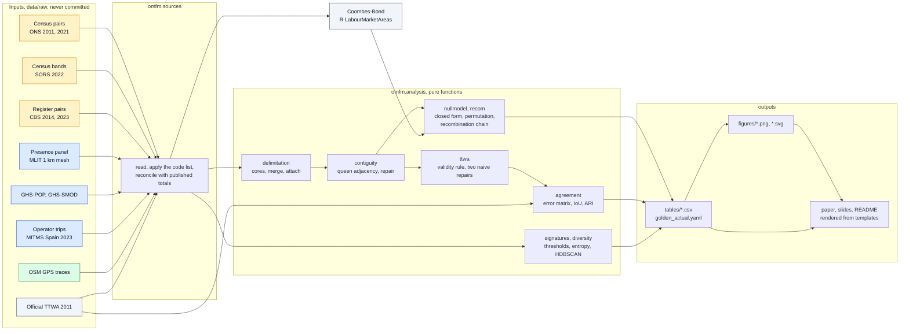

# urban-functional-maps

[](https://github.com/m-erts/urban-functional-maps/actions/workflows/ci.yml)
[](LICENSE)
[](LICENSE-CONTENT)

Open mobility data for functional-area maps: what each source leaves out, and how much of a result is scale, contiguity and algorithm.

Pipeline, paper and slides for the talk *Eurostat vs OSM vs Census: Choosing Open Mobility Data for Urban Function Maps*, prepared for FOSS4G 2026, Hiroshima. The talk was accepted; the author was unable to present it, and the material is published here in full.

| | |
|---|---|
| Paper (preprint) | [docs/paper/paper.md](docs/paper/paper.md) · [PDF](docs/paper/paper.pdf) |
| Slides | [docs/slides/index.html](docs/slides/index.html) · [PDF](docs/slides/slides.pdf) |
| Every number, with its status against the first version of the slides | [docs/RESULTS.md](docs/RESULTS.md) |
| Corrections to the first version of the slides | [docs/ERRATA.md](docs/ERRATA.md) |
| Inputs, licences, checksums | [docs/DATA_SOURCES.md](docs/DATA_SOURCES.md) · [data/manifest.yaml](data/manifest.yaml) |

## Research question

When functional areas are delimited from open data on the movement of people, how much of the result comes from the coding of the source, how much from the zoning (the modifiable areal unit problem), and how much from the algorithm? Which tests, run on the open file alone, separate the three?

## Findings

1. **Coding.** The 2021 census of England and Wales codes {{uk_home_2021/1e6:.1f}} million people without a commute with workplace = residence. Kept in the matrix, they raise within-unit commuting from {{uk_diag_2021_clean:.3f}} to {{uk_diag_2021_naive:.3f}}.
2. **Scale, contiguity, placement.** Self-containment under random relabelling has a closed form, `d + (1 - d) h`. A recombination Markov chain on spanning trees gives the second baseline: contiguous partitions with the same area sizes. Over {{dec_partitions}} partitions in three countries, the part of the score that depends on where the boundaries run is {{dec_placement_min:.3f}} to {{dec_placement_max:.3f}}. Scale is the largest part on Dutch municipalities, contiguity on English MSOAs.
3. **Construction and coding.** The Coombes-Bond algorithm (R package LabourMarketAreas 3.4) with the parameters of the official Travel to Work Areas gives {{uk_lma_areas_2011}} areas on the open 2011 matrix of commuters. Counting people who work at home or have no fixed workplace at their residence, as ONS did, raises this to {{uk_lma_ons_areas_2011}}; the official map has {{uk_ttwa_official_touching_ew_2011}} (adjusted Rand index {{uk_ari_lma_2011:.2f}} and {{uk_ari_lma_ons_2011:.2f}}). Two naive repairs of the same validity rule give {{uk_ttwa_greedy_2011}} and {{uk_ttwa_dissolution_2011}} areas. {{uk_sweep_near_maps}} settings of a heuristic that all give about {{uk_areas_flows_only_2021}} areas agree with each other at a median of {{uk_sweep_near_ari_median:.2f}}.
4. **Old regions.** On Dutch municipal pairs of 2023, {{nl23_corop_valid_share*100:.0f}} % of the 40 COROP regions designed in 1970 meet the validity rule. Their placement term is {{dec_nl_2023_corop_from_placement:.3f}}, against {{dec_nl_2023_lma_from_placement:.3f}} for Coombes-Bond on the same pairs.
5. **Operator data.** Spain publishes trips between {{es_zones_spain:,}} districts with the hour and the activity at both ends. Trips from home to work or study peak at {{es_commute_peak_hour:02d}}:00. A heuristic with the parameters set on England and Wales leaves {{es_own_unassigned_share*100:.0f}} % of them without an area; Coombes-Bond returns {{es_lma_areas}} areas.
6. **Classes.** Temporal profiles of {{jp_profile_cells:,}} cells in Hiroshima form one cloud: HDBSCAN returns only noise at {{jp_hdbscan_comp_all_noise_settings}} of {{jp_hdbscan_settings}} settings, and the share of "mixed" cells runs from {{jp_sig_mixed_share_min*100:.0f}} % to {{jp_sig_mixed_share_max*100:.0f}} % with the threshold.

| Partition | Areas | Self-containment | from scale | from contiguity | from placement |
|---|---|---|---|---|---|
| England and Wales 2011, heuristic | {{dec_uk_2011_own_areas}} | {{dec_uk_2011_own_observed:.3f}} | {{dec_uk_2011_own_from_scale:.3f}} | {{dec_uk_2011_own_from_contiguity:.3f}} | {{dec_uk_2011_own_from_placement:.3f}} |
| England and Wales 2011, Coombes-Bond, commuters only | {{dec_uk_2011_lma_areas}} | {{dec_uk_2011_lma_observed:.3f}} | {{dec_uk_2011_lma_from_scale:.3f}} | {{dec_uk_2011_lma_from_contiguity:.3f}} | {{dec_uk_2011_lma_from_placement:.3f}} |
| England and Wales 2011, Coombes-Bond, home workers at home | {{dec_uk_2011_lma_ons_areas}} | {{dec_uk_2011_lma_ons_observed:.3f}} | {{dec_uk_2011_lma_ons_from_scale:.3f}} | {{dec_uk_2011_lma_ons_from_contiguity:.3f}} | {{dec_uk_2011_lma_ons_from_placement:.3f}} |
| England and Wales 2011, official TTWA | {{dec_uk_2011_official_areas}} | {{dec_uk_2011_official_observed:.3f}} | {{dec_uk_2011_official_from_scale:.3f}} | {{dec_uk_2011_official_from_contiguity:.3f}} | {{dec_uk_2011_official_from_placement:.3f}} |
| England and Wales 2021, heuristic | {{dec_uk_2021_own_areas}} | {{dec_uk_2021_own_observed:.3f}} | {{dec_uk_2021_own_from_scale:.3f}} | {{dec_uk_2021_own_from_contiguity:.3f}} | {{dec_uk_2021_own_from_placement:.3f}} |
| England and Wales 2021, official TTWA | {{dec_uk_2021_official_areas}} | {{dec_uk_2021_official_observed:.3f}} | {{dec_uk_2021_official_from_scale:.3f}} | {{dec_uk_2021_official_from_contiguity:.3f}} | {{dec_uk_2021_official_from_placement:.3f}} |
| Netherlands 2023, heuristic | {{dec_nl_2023_own_areas}} | {{dec_nl_2023_own_observed:.3f}} | {{dec_nl_2023_own_from_scale:.3f}} | {{dec_nl_2023_own_from_contiguity:.3f}} | {{dec_nl_2023_own_from_placement:.3f}} |
| Netherlands 2023, Coombes-Bond | {{dec_nl_2023_lma_areas}} | {{dec_nl_2023_lma_observed:.3f}} | {{dec_nl_2023_lma_from_scale:.3f}} | {{dec_nl_2023_lma_from_contiguity:.3f}} | {{dec_nl_2023_lma_from_placement:.3f}} |
| Netherlands 2023, COROP of 1970 | {{dec_nl_2023_corop_areas}} | {{dec_nl_2023_corop_observed:.3f}} | {{dec_nl_2023_corop_from_scale:.3f}} | {{dec_nl_2023_corop_from_contiguity:.3f}} | {{dec_nl_2023_corop_from_placement:.3f}} |
| Spain 2023, heuristic | {{dec_es_2023_own_areas}} | {{dec_es_2023_own_observed:.3f}} | {{dec_es_2023_own_from_scale:.3f}} | {{dec_es_2023_own_from_contiguity:.3f}} | {{dec_es_2023_own_from_placement:.3f}} |
| Spain 2023, Coombes-Bond | {{dec_es_2023_lma_areas}} | {{dec_es_2023_lma_observed:.3f}} | {{dec_es_2023_lma_from_scale:.3f}} | {{dec_es_2023_lma_from_contiguity:.3f}} | {{dec_es_2023_lma_from_placement:.3f}} |


## Sources compared on six axes

Colour in every figure and slide: **Eurostat-type grid and presence statistics, blue** · **OpenStreetMap, green** · **census and register counts, amber**.

| Source | Spatial resolution | Temporal lag | Semantic depth | Licence | MAUP sensitivity | Computational cost |
|---|---|---|---|---|---|---|
| **Census pairs**, England and Wales (ONS WU01EW 2011, ODWP01EW 2021) | {{uk_msoa_n:,}} MSOA polygons, 5,000 to 15,000 residents each; also districts and output areas | 2011: census March 2011, file August 2014. 2021: census March 2021, file October 2023 | Work only. 2021 adds a place-of-work indicator of 4 categories. No time of day | OGL v3 | Measured. Scale alone gives {{uk_null_share_msoa_2021*100:.0f}} % of the score at MSOA level and {{uk_district_null_share_clean*100:.0f}} % at district level | 1.8 M pairs. Delimitation 3 s; one permutation 20 ms; one random contiguous partition 0.2 s; validity repair by dissolution 80 s |
| **Census bands**, Serbia (SORS 2022) | {{rs_municipalities}} municipal polygons; destination in 4 nested bands | Census October 2022, table July 2024 | Work; education with pupils and students as one number | SORS terms, source cited | Not testable: one published level. {{rs_single_settlement}} units are 0 by definition | Seconds. Urbanisation from a 100 m raster: 3 s |
| **Register pairs**, Netherlands (CBS 81252NED) | {{nl_regions}} COROP regions | December 2014, table October 2016 | Jobs of employees; sex and age | CC BY 4.0 | Not testable: pairs only between the 40 regions of 1970, which are the partition to be tested | 1,600 pairs; 27 s to fetch through OData |
| **Register pairs**, Netherlands (CBS 85481NED) | {{nl23_units}} municipalities; pairs to the nearest 100 jobs | December 2023, table December 2025; provisional | Jobs of employees; place of work modelled by CBS | CC BY 4.0 | Measured. Scale gives {{dec_nl_2023_corop_share_scale*100:.0f}} % of the score of the COROP regions, contiguity {{dec_nl_2023_corop_share_contiguity*100:.0f}} % | 10,000 pairs; 3 min to fetch; Coombes-Bond {{nl23_lma_seconds:.0f}} s |
| **Operator trips**, Spain (MITMS, Orange España data) | {{es_zones_spain:,}} districts: municipalities, groups of small ones, census districts of cities; plus NUTS-3 regions of France and Portugal | One file per day since January 2022; 26 October 2023 missing; method change on 1 July 2025 breaks the series | Trips by hour of departure and by activity at both ends (home, work or study, frequent, other) | Ministry open-data licence, attribution required | Measured. Scale gives {{dec_es_2023_lma_share_scale*100:.0f}} % of the score of the Coombes-Bond areas, contiguity {{dec_es_2023_lma_share_contiguity*100:.0f}} % | 190 MB per day; 5 days read in 8 min; Coombes-Bond {{es_lma_seconds/60:.0f}} min |
| **Presence panel**, Japan (MLIT, provider Agoop) | 1 km mesh (JIS X 0410), 6,763 cells in one prefecture; 30 municipalities | About one month while it ran; no data after December 2021 | No purpose. Month x weekday or holiday x day or night. Residence in 4 nested rings | Government of Japan Standard Terms of Use 2.0 | Regular grid: no zoning choice at 1 km. Class shares depend on the threshold: mixed {{jp_sig_mixed_share_min*100:.0f}} to {{jp_sig_mixed_share_max*100:.0f}} % | 1.07 M rows; HDBSCAN grid of 24 runs on 4,011 cells: 4 s |
| **OSM public GPS traces** | Points; aggregated to H3 resolution 8 (0.74 km²) | None at upload; median trace year {{osm_bgd_median_year}} to {{osm_hij_median_year}} in the three windows | Timestamp and position; no purpose, no person | ODbL | Not measured. {{osm_hij_top_cell*100:.0f}} % of points in one cell in Hiroshima, so any statistic depends on where the cell boundary falls | 40 requests per window at one per second |
| **Grid reference**, GHS-POP 100 m and GHS-SMOD 1 km (JRC; degree of urbanisation of Eurostat and partners) | 100 m and 1 km, Mollweide | Release R2023A; epoch 2030 is a projection | Population; 8 settlement classes | CC BY 4.0 | Measured. Work self-containment against urban share: r = {{rs_r_sc_urb_area:+.2f}} weighted by area, {{rs_r_sc_urb_pop:+.2f}} weighted by population | 75 MB tile; zonal statistics 3 s |

Eurostat statistics from mobile network operators do not exist as a cross-country dataset; the Multi-MNO project published a method and [open reference code](https://github.com/eurostat/multimno). Spain publishes the national product: trips between districts by hour and purpose, from the data of one operator.

What each source publishes of the three dimensions:

| Source | Origin-destination pairs | Purpose | Time of day or week |
|---|---|---|---|
| Census pairs, England and Wales | full matrix | work | none |
| Census bands, Serbia | none, 4 bands | work; education | none |
| Register pairs, Netherlands 2014 | {{nl_regions}} x {{nl_regions}} | work | none |
| Register pairs, Netherlands 2023 | {{nl23_units}} x {{nl23_units}}, to the nearest 100 jobs | work | none |
| Operator trips, Spain 2023 | {{es_zones_spain:,}} x {{es_zones_spain:,}} districts | home, work or study, other | hour |
| Presence panel, Japan | none, 4 rings | none | month, day type, day or night |
| OSM traces | trajectories of contributors | none | timestamps |

## Method



The measures, in one place (derivations in the [paper](docs/paper/paper.md), Section 3):

| Measure | Definition | Module |
|---|---|---|
| Diagonal share | `d = sum_i T_ii / T` | `analysis.selfcontainment` |
| Self-containment of a partition | flows that end in the area where they start / flows leaving labelled units | `analysis.selfcontainment` |
| Scale null, closed form | `E[SC0] = (D + h B) / T_L`, `h = sum_a n_a (n_a - 1) / (n (n - 1))` | `analysis.nullmodel.expected_sc` |
| Zoning null | mean self-containment of contiguous partitions of the same sizes, drawn by a recombination chain on spanning trees | `analysis.recom.recom_null` |
| Spatial error matrix | `C[a, b] = sum of employed residents in candidate area a and reference area b` | `analysis.agreement.contingency` |
| Intersection over union | `C[a,b] / (C[a,.] + C[.,b] - C[a,b])`, best match per reference area | `analysis.agreement.match_report` |
| Omission, commission | `1 - C[a*,b] / C[.,b]`, `1 - C[a*,b] / C[a*,.]` | `analysis.agreement.match_report` |
| Adjusted Rand index, V-measure | from `C` | `analysis.agreement` |
| Entropy of a class or category distribution | `H = - sum p ln p`; Hill numbers of order 1 and 2 | `analysis.diversity` |
| Sample of a trace archive | distinct minutes; share of points in the busiest cell | `analysis.osm` |
| Convergence of the chain | steps to leave the start; lag-1 autocorrelation; Geweke statistic | `analysis.recom.trace_diagnostics` |

## Reproduce

```bash
git clone https://github.com/m-erts/urban-functional-maps.git
cd urban-functional-maps
conda env create -f environment.yml && conda activate omfm     # or: pip install -r requirements.lock && pip install -e .
make env-r                          # R environment for the Coombes-Bond step (r/environment-r.yml)
python scripts/fetch_data.py        # downloads what has a public address, lists what needs a manual step
make all                            # analysis, figures, register, documents, tests
```

| Step | Command | Time on a laptop (Apple M-series, 2026) |
|---|---|---|
| England and Wales: matrices, delimitation, nulls, repairs, agreement | `python scripts/run.py analysis --only uk` | 7 min |
| Iso-count experiment | `python scripts/run.py analysis --only uk_sweep` | 1 min |
| Serbia, Netherlands 2014, Japan, OSM | `python scripts/run.py analysis --only rs,nl,jp,osm` | 10 s |
| Netherlands 2023, Spain: matrices and heuristic | `python scripts/run.py analysis --only nl23,es` | 3 min (Spain: 8 min the first time, to read five daily files) |
| Coombes-Bond, four matrices, in R | `make lma` | {{nl23_lma_seconds:.0f}} s (Netherlands), {{es_lma_seconds/60:.0f}} min (Spain), {{uk_lma_seconds_2011/60:.0f}} and {{uk_lma_ons_seconds_2011/60:.0f}} min (England and Wales, two codings) |
| Agreement with Coombes-Bond; recombination chains for {{dec_partitions}} partitions | `python scripts/run.py analysis --only uk_lma,nl23,es,decomposition` | about 50 min the first time; cached in `data/interim` afterwards |
| Figures | `python scripts/run.py figures` | 2 min |
| Register and documents | `python scripts/run.py register && python scripts/render_docs.py` | 1 s |
| Tests | `pytest -q` | 1 min with data, 2 s without |

Peak memory is about 3 GB (reading the 2021 matrix). No GPU. With Docker: `docker compose run --rm pipeline`.

One script runs without any download and is a separate entry point (the lightning talk *50 Lines of Python*):

```bash
python scripts/neighborhood_dna.py 34.30 132.35 34.48 132.55 hiroshima
```

It reads Overture Places from S3 with DuckDB and writes entropy and Hill numbers of the category mix per H3 cell.

### What guarantees that the numbers are the numbers

- All parameters are in [config/params.yaml](config/params.yaml).
- The pipeline writes every number to `outputs/tables/golden_actual.yaml`.
- `README.md`, the paper, the slides and the announcement are rendered from `templates/`; their numbers are placeholders that name entries of that file. `python scripts/render_docs.py --check` fails if a document is out of date.
- [tests/golden_values.yaml](tests/golden_values.yaml) is a frozen copy; `pytest` compares a new run with it.
- [tests/deck_values.yaml](tests/deck_values.yaml) holds the {{deck_numbers}} numbers of the first version of the slides; [docs/RESULTS.md](docs/RESULTS.md) states for each whether the pipeline reproduces it.
- A run in a fresh environment built from [requirements.lock](requirements.lock) gave the same values.
- The Coombes-Bond step replaces one per-row grouping in LabourMarketAreas by `pmin()`, for speed. `Rscript r/check_patch.R data/interim/nl_od_2023.csv` runs the package both ways and reports whether the partitions are identical; they are, on the Dutch and on the Spanish matrix.

## Repository

```
config/params.yaml        every parameter
data/manifest.yaml        every input: address, licence, SHA-256
data/derived/             small aggregates that can no longer be drawn from their source
src/omfm/sources/         one module per source: read, clean, reconcile
src/omfm/analysis/        pure functions: delimitation, contiguity, nullmodel, recom, ttwa, agreement, signatures, diversity, osm
src/omfm/cases_pairs.py   Coombes-Bond agreement, Netherlands 2023, Spain 2023, decomposition for all three
r/                        run_lma.R and the R environment of the Coombes-Bond step
src/omfm/viz/             figure style (DESIGN.md) and one function per figure
src/omfm/pipeline.py      raw files to tables
scripts/                  run.py, fetch_data.py, render_docs.py, neighborhood_dna.py, build_pdf.sh
templates/                sources of README, paper, slides, announcement
outputs/tables            result tables and golden_actual.yaml, committed
docs/                     paper, slides, figures, register, errata, data sources
tests/                    unit tests, reconciliation with published totals, regression snapshot
```

## Limits

Three countries with three kinds of count: persons at a census, employee jobs with a modelled place of work, expanded trips. A census taken in a lockdown. Official areas are built from blocks smaller than the units used here, and {{uk_msoa_cut_by_ttwa_2021}} units are cut by an official boundary. The recombination chain samples the spanning-tree distribution, not the uniform one. The official production code was not run; LabourMarketAreas is the open implementation of the published method. The full list is Section 6 of the [paper](docs/paper/paper.md).

## Licences and attribution

Code: MIT. Text, figures, slides: CC BY 4.0. Data keep the licence of their publisher:
Office for National Statistics, Open Government Licence v3.0 · Statistical Office of the Republic of Serbia · GeoSrbija · Statistics Netherlands, CC BY 4.0 · Basado en datos abiertos Ministerio de Transportes y Movilidad Sostenible (transportes.gob.es), mobile network data of Orange España · Ministry of Land, Infrastructure, Transport and Tourism of Japan, provider Agoop · European Commission JRC (GHSL), CC BY 4.0 · © OpenStreetMap contributors, ODbL · Overture Maps Foundation, CDLA-Permissive-2.0.
Tables in `outputs/tables/osm_*` are derived from OpenStreetMap data and are available under the ODbL.

The 2022 census of Serbia does not cover Kosovo\*. \* This designation is without prejudice to positions on status, and is in line with UNSCR 1244/1999 and the ICJ Opinion on the Kosovo declaration of independence.

## Cite

Ercegovac, M. (2026). *Open mobility data for functional-area maps: what each source leaves out, and how much of the result is scale, contiguity and algorithm* (version 1.0.0). https://github.com/m-erts/urban-functional-maps

Author: Marija Ercegovac, [orcid.org/0009-0008-3040-5515](https://orcid.org/0009-0008-3040-5515). Machine-readable: [CITATION.cff](CITATION.cff). A DOI is assigned by Zenodo when the first release is published; see [docs/PUBLISHING.md](docs/PUBLISHING.md).
